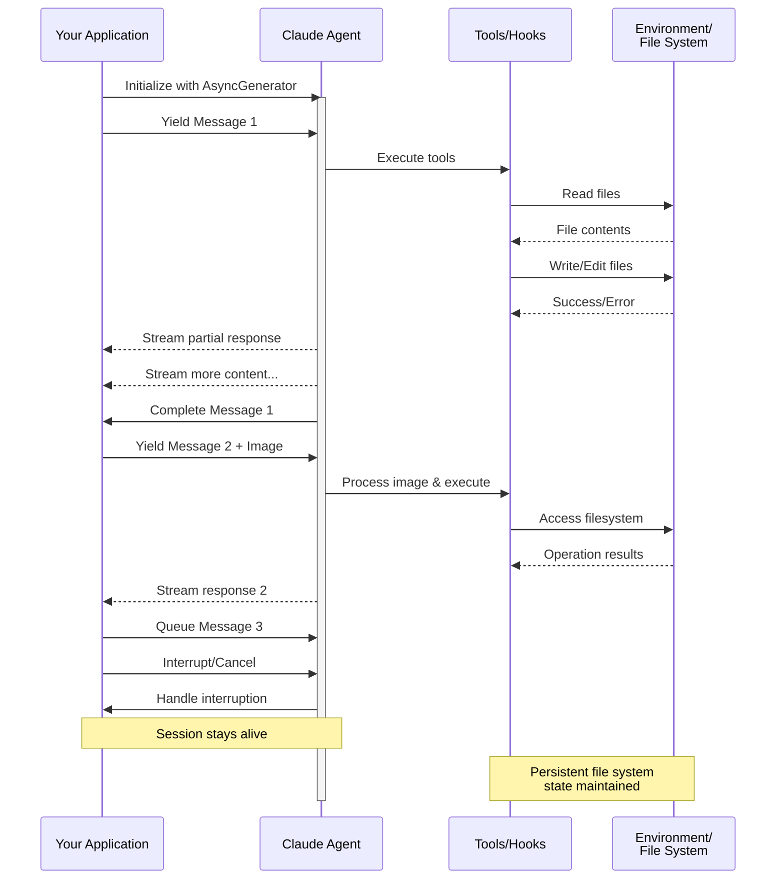

> ## Documentation Index
> Fetch the complete documentation index at: https://code.claude.com/docs/llms.txt
> Use this file to discover all available pages before exploring further.

# Streaming-Eingabe

> Verständnis der zwei Eingabemodi für Claude Agent SDK und wann jeder verwendet wird

<h2 id="overview">
  Übersicht
</h2>

Das Claude Agent SDK unterstützt zwei unterschiedliche Eingabemodi für die Interaktion mit Agenten:

* **Streaming-Eingabemodus** (Standard & Empfohlen) - Eine persistente, interaktive Sitzung
* **Einzelne Nachricht-Eingabe** - One-Shot-Abfragen, die Sitzungszustand und Wiederaufnahme verwenden

Dieser Leitfaden erklärt die Unterschiede, Vorteile und Anwendungsfälle für jeden Modus, um Ihnen bei der Wahl des richtigen Ansatzes für Ihre Anwendung zu helfen.

<h2 id="streaming-input-mode-recommended">
  Streaming-Eingabemodus (Empfohlen)
</h2>

Der Streaming-Eingabemodus ist die **bevorzugte** Methode zur Verwendung des Claude Agent SDK. Er bietet vollständigen Zugriff auf die Fähigkeiten des Agenten und ermöglicht umfangreiche, interaktive Erfahrungen.

Er ermöglicht es dem Agenten, als langlebiger Prozess zu fungieren, der Benutzereingaben entgegennimmt, Unterbrechungen verarbeitet, Berechtigungsanfragen anzeigt und die Sitzungsverwaltung übernimmt.

<h3 id="how-it-works">
  Funktionsweise
</h3>



<h3 id="benefits">
  Vorteile
</h3>

<CardGroup cols={2}>
  <Card title="Bild-Uploads" icon="image">
    Bilder direkt an Nachrichten anhängen für visuelle Analyse und Verständnis
  </Card>

  <Card title="Warteschlangen-Nachrichten" icon="stack">
    Mehrere Nachrichten senden, die sequenziell verarbeitet werden, mit der Möglichkeit zu unterbrechen
  </Card>

  <Card title="Tool-Integration" icon="wrench">
    Vollständiger Zugriff auf alle Tools und benutzerdefinierten MCP-Server während der Sitzung
  </Card>

  <Card title="Echtzeit-Feedback" icon="lightning">
    Sehen Sie Antworten, während sie generiert werden, nicht nur die endgültigen Ergebnisse
  </Card>

  <Card title="Kontext-Persistenz" icon="database">
    Behalten Sie den Gesprächskontext über mehrere Umdrehungen hinweg natürlich bei
  </Card>
</CardGroup>

<h3 id="implementation-example">
  Implementierungsbeispiel
</h3>

<CodeGroup>
  ```typescript TypeScript theme={null}
  import { query, type SDKUserMessage } from "@anthropic-ai/claude-agent-sdk";
  import { readFile } from "fs/promises";

  async function* generateMessages(): AsyncGenerator<SDKUserMessage> {
    // First message
    yield {
      type: "user",
      message: {
        role: "user",
        content: "Analyze this codebase for security issues"
      },
      parent_tool_use_id: null
    };

    // Wait for conditions or user input
    await new Promise((resolve) => setTimeout(resolve, 2000));

    // Follow-up with image
    yield {
      type: "user",
      message: {
        role: "user",
        content: [
          {
            type: "text",
            text: "Review this architecture diagram"
          },
          {
            type: "image",
            source: {
              type: "base64",
              media_type: "image/png",
              data: await readFile("diagram.png", "base64")
            }
          }
        ]
      },
      parent_tool_use_id: null
    };
  }

  // Process streaming responses
  for await (const message of query({
    prompt: generateMessages(),
    options: {
      maxTurns: 10,
      allowedTools: ["Read", "Grep"]
    }
  })) {
    if (message.type === "result" && message.subtype === "success") {
      console.log(message.result);
    }
  }
  ```

  ```python Python theme={null}
  from claude_agent_sdk import (
      ClaudeSDKClient,
      ClaudeAgentOptions,
      AssistantMessage,
      TextBlock,
  )
  import asyncio
  import base64


  async def streaming_analysis():
      async def message_generator():
          # First message
          yield {
              "type": "user",
              "message": {
                  "role": "user",
                  "content": "Analyze this codebase for security issues",
              },
          }

          # Wait for conditions
          await asyncio.sleep(2)

          # Follow-up with image
          with open("diagram.png", "rb") as f:
              image_data = base64.b64encode(f.read()).decode()

          yield {
              "type": "user",
              "message": {
                  "role": "user",
                  "content": [
                      {"type": "text", "text": "Review this architecture diagram"},
                      {
                          "type": "image",
                          "source": {
                              "type": "base64",
                              "media_type": "image/png",
                              "data": image_data,
                          },
                      },
                  ],
              },
          }

      # Use ClaudeSDKClient for streaming input
      options = ClaudeAgentOptions(max_turns=10, allowed_tools=["Read", "Grep"])

      async with ClaudeSDKClient(options) as client:
          # Send streaming input
          await client.query(message_generator())

          # Process responses
          async for message in client.receive_response():
              if isinstance(message, AssistantMessage):
                  for block in message.content:
                      if isinstance(block, TextBlock):
                          print(block.text)


  asyncio.run(streaming_analysis())
  ```
</CodeGroup>

<Note>
  Im TypeScript SDK endet der Stream mit einem Fehler, der `Claude Code process aborted by user` lautet, wenn Ihr Nachrichtengenerator beispielsweise eine fehlende Datei liest, anstatt den ursprünglichen Fehler anzuzeigen. Überprüfen Sie daher zuerst den Code in Ihrem Generator, wenn Sie diese Meldung sehen. Der Fehler kann auch einer langen verkleinerten Zeile mit gebündeltem SDK-Quellcode vorangehen, daher lesen Sie bis zum Ende der Ausgabe, um den Fehlertext zu finden.

  Im Python SDK wird eine Generatorausnahme auf Debug-Ebene protokolliert und die Sitzung stellt sich ohne Auslösen ein. Wenn also eine Streaming-Sitzung ohne Ausgabe hängen bleibt, aktivieren Sie Debug-Protokollierung und überprüfen Sie Ihren Generator.
</Note>

<h2 id="single-message-input">
  Einzelne Nachricht-Eingabe
</h2>

Die Eingabe einer einzelnen Nachricht ist einfacher, aber begrenzter.

<h3 id="when-to-use-single-message-input">
  Wann sollte die Eingabe einer einzelnen Nachricht verwendet werden
</h3>

Verwenden Sie die Eingabe einer einzelnen Nachricht, wenn:

* Sie eine One-Shot-Antwort benötigen
* Sie keine Bild-Anhänge oder Mid-Session-Kontrollmethoden benötigen
* Sie in einer zustandslosen Umgebung arbeiten müssen, z. B. in einer Lambda-Funktion

<h3 id="limitations">
  Einschränkungen
</h3>

<Warning>
  Der Modus für die Eingabe einer einzelnen Nachricht unterstützt **nicht**:

  * Direkte Bild-Anhänge in Nachrichten
  * Dynamische Nachrichtenwarteschlangen
  * Echtzeit-Unterbrechung
  * Natürliche Multi-Turn-Gespräche
</Warning>

Wenn eine Abfrage mit einem Fehler endet, z. B. `error_max_turns`, löst ein einzelner `query()`-Aufruf einen Fehler aus, der den Fehlertext nach dem Ausgeben der endgültigen Ergebnisnachricht enthält. Wickeln Sie daher die Schleife in einen Try-Block ein, wenn Ihr Code fortgesetzt werden muss. Siehe [Ergebnis verarbeiten](/docs/de/agent-sdk/agent-loop#handle-the-result) für die Ergebnis-Untertypen.

<h3 id="implementation-example-1">
  Implementierungsbeispiel
</h3>

<CodeGroup>
  ```typescript TypeScript theme={null}
  import { query } from "@anthropic-ai/claude-agent-sdk";

  // Simple one-shot query
  for await (const message of query({
    prompt: "Explain the authentication flow",
    options: {
      maxTurns: 1,
      allowedTools: ["Read", "Grep"]
    }
  })) {
    if (message.type === "result" && message.subtype === "success") {
      console.log(message.result);
    }
  }

  // Continue conversation with session management
  for await (const message of query({
    prompt: "Now explain the authorization process",
    options: {
      continue: true,
      maxTurns: 1
    }
  })) {
    if (message.type === "result" && message.subtype === "success") {
      console.log(message.result);
    }
  }
  ```

  ```python Python theme={null}
  from claude_agent_sdk import query, ClaudeAgentOptions, ResultMessage
  import asyncio


  async def single_message_example():
      # Simple one-shot query using query() function
      async for message in query(
          prompt="Explain the authentication flow",
          options=ClaudeAgentOptions(max_turns=1, allowed_tools=["Read", "Grep"]),
      ):
          if isinstance(message, ResultMessage):
              print(message.result)

      # Continue conversation with session management
      async for message in query(
          prompt="Now explain the authorization process",
          options=ClaudeAgentOptions(continue_conversation=True, max_turns=1),
      ):
          if isinstance(message, ResultMessage):
              print(message.result)


  asyncio.run(single_message_example())
  ```
</CodeGroup>
