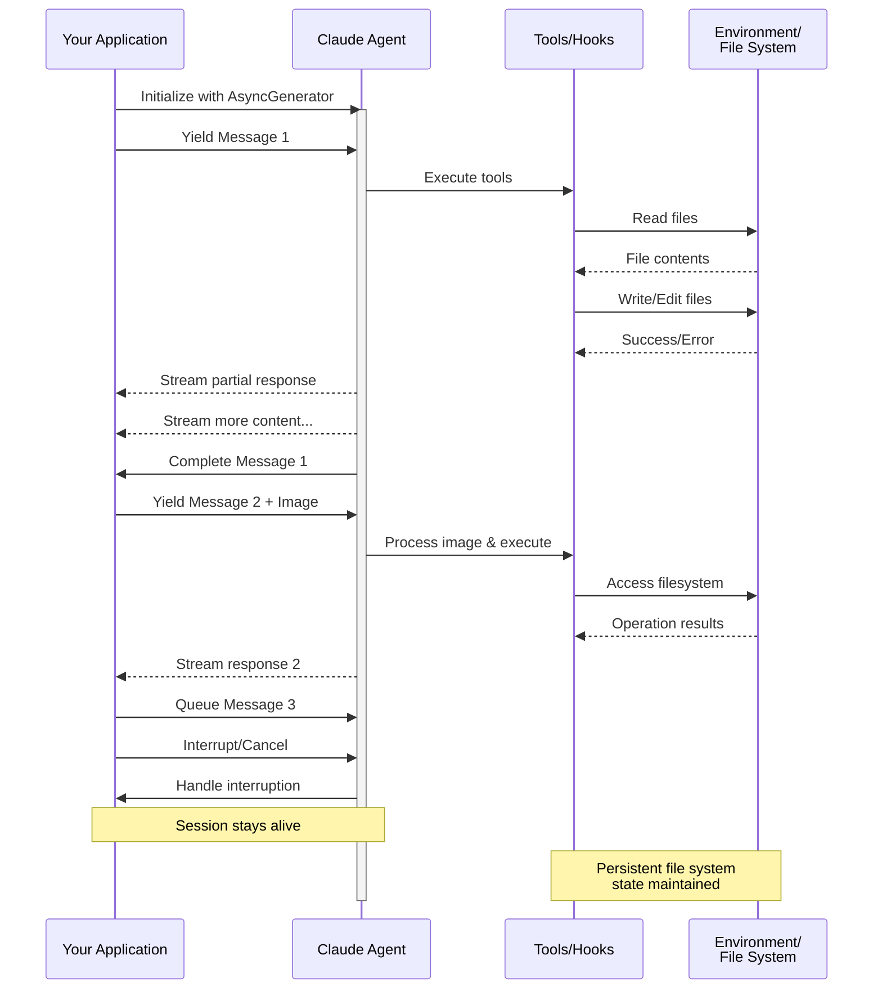

> ## Documentation Index
> Fetch the complete documentation index at: https://code.claude.com/docs/llms.txt
> Use this file to discover all available pages before exploring further.

# Entrada de Streaming

> Comprensión de los dos modos de entrada para Claude Agent SDK y cuándo usar cada uno

<h2 id="overview">
  Descripción General
</h2>

El Claude Agent SDK admite dos modos de entrada distintos para interactuar con agentes:

* **Modo de Entrada de Streaming** (Predeterminado y Recomendado) - Una sesión persistente e interactiva
* **Entrada de Mensaje Único** - Consultas de una sola vez que utilizan el estado de la sesión y la reanudación

Esta guía explica las diferencias, beneficios y casos de uso para cada modo para ayudarle a elegir el enfoque correcto para su aplicación.

<h2 id="streaming-input-mode-recommended">
  Modo de Entrada de Streaming (Recomendado)
</h2>

El modo de entrada de streaming es la forma **preferida** de usar el Claude Agent SDK. Proporciona acceso completo a las capacidades del agente y permite experiencias ricas e interactivas.

Permite que el agente funcione como un proceso de larga duración que recibe entrada del usuario, maneja interrupciones, muestra solicitudes de permisos y gestiona la sesión.

<h3 id="how-it-works">
  Cómo Funciona
</h3>



<h3 id="benefits">
  Beneficios
</h3>

<CardGroup cols={2}>
  <Card title="Cargas de Imágenes" icon="image">
    Adjunte imágenes directamente a los mensajes para análisis visual y comprensión
  </Card>

  <Card title="Mensajes en Cola" icon="stack">
    Envíe múltiples mensajes que se procesen secuencialmente, con capacidad de interrumpir
  </Card>

  <Card title="Integración de Herramientas" icon="wrench">
    Acceso completo a todas las herramientas y servidores MCP personalizados durante la sesión
  </Card>

  <Card title="Retroalimentación en Tiempo Real" icon="lightning">
    Vea las respuestas mientras se generan, no solo los resultados finales
  </Card>

  <Card title="Persistencia de Contexto" icon="database">
    Mantenga el contexto de la conversación en múltiples turnos de forma natural
  </Card>
</CardGroup>

<h3 id="implementation-example">
  Ejemplo de Implementación
</h3>

<CodeGroup>
  ```typescript TypeScript theme={null}
  import { query, type SDKUserMessage } from "@anthropic-ai/claude-agent-sdk";
  import { readFile } from "fs/promises";

  async function* generateMessages(): AsyncGenerator<SDKUserMessage> {
    // First message
    yield {
      type: "user",
      message: {
        role: "user",
        content: "Analyze this codebase for security issues"
      },
      parent_tool_use_id: null
    };

    // Wait for conditions or user input
    await new Promise((resolve) => setTimeout(resolve, 2000));

    // Follow-up with image
    yield {
      type: "user",
      message: {
        role: "user",
        content: [
          {
            type: "text",
            text: "Review this architecture diagram"
          },
          {
            type: "image",
            source: {
              type: "base64",
              media_type: "image/png",
              data: await readFile("diagram.png", "base64")
            }
          }
        ]
      },
      parent_tool_use_id: null
    };
  }

  // Process streaming responses
  for await (const message of query({
    prompt: generateMessages(),
    options: {
      maxTurns: 10,
      allowedTools: ["Read", "Grep"]
    }
  })) {
    if (message.type === "result" && message.subtype === "success") {
      console.log(message.result);
    }
  }
  ```

  ```python Python theme={null}
  from claude_agent_sdk import (
      ClaudeSDKClient,
      ClaudeAgentOptions,
      AssistantMessage,
      TextBlock,
  )
  import asyncio
  import base64


  async def streaming_analysis():
      async def message_generator():
          # First message
          yield {
              "type": "user",
              "message": {
                  "role": "user",
                  "content": "Analyze this codebase for security issues",
              },
          }

          # Wait for conditions
          await asyncio.sleep(2)

          # Follow-up with image
          with open("diagram.png", "rb") as f:
              image_data = base64.b64encode(f.read()).decode()

          yield {
              "type": "user",
              "message": {
                  "role": "user",
                  "content": [
                      {"type": "text", "text": "Review this architecture diagram"},
                      {
                          "type": "image",
                          "source": {
                              "type": "base64",
                              "media_type": "image/png",
                              "data": image_data,
                          },
                      },
                  ],
              },
          }

      # Use ClaudeSDKClient for streaming input
      options = ClaudeAgentOptions(max_turns=10, allowed_tools=["Read", "Grep"])

      async with ClaudeSDKClient(options) as client:
          # Send streaming input
          await client.query(message_generator())

          # Process responses
          async for message in client.receive_response():
              if isinstance(message, AssistantMessage):
                  for block in message.content:
                      if isinstance(block, TextBlock):
                          print(block.text)


  asyncio.run(streaming_analysis())
  ```
</CodeGroup>

<Note>
  En el SDK de TypeScript, si su generador de mensajes lanza una excepción, por ejemplo cuando falta un archivo que lee, la secuencia termina con un error que dice `Claude Code process aborted by user` en lugar del error original, así que verifique el código dentro de su generador primero cuando vea ese mensaje. El error también puede estar precedido por una línea minificada larga del código fuente del SDK agrupado, así que lea hasta el final de la salida para encontrar el texto del error.

  En el SDK de Python, una excepción del generador se registra en el nivel de depuración y la sesión se detiene sin generar una excepción, así que si una sesión de streaming se cuelga sin salida, habilite el registro de depuración y verifique su generador.
</Note>

<h2 id="single-message-input">
  Entrada de Mensaje Único
</h2>

La entrada de mensaje único es más simple pero más limitada.

<h3 id="when-to-use-single-message-input">
  Cuándo Usar Entrada de Mensaje Único
</h3>

Use entrada de mensaje único cuando:

* Necesite una respuesta de una sola vez
* No necesite adjuntos de imágenes ni métodos de control a mitad de sesión
* Necesite operar en un entorno sin estado, como una función lambda

<h3 id="limitations">
  Limitaciones
</h3>

<Warning>
  El modo de entrada de mensaje único **no** admite:

  * Adjuntos de imágenes directas en mensajes
  * Encolamiento dinámico de mensajes
  * Interrupción en tiempo real
  * Conversaciones naturales de múltiples turnos
</Warning>

Si una consulta termina con un resultado de error, como `error_max_turns`, una llamada única a `query()` genera un error que incluye el texto de fallo después de ceder el mensaje de resultado final, así que envuelva el bucle en un bloque try si su código necesita continuar. Consulte [Manejar el resultado](/docs/es/agent-sdk/agent-loop#handle-the-result) para los subtipos de resultado.

<h3 id="implementation-example-1">
  Ejemplo de Implementación
</h3>

<CodeGroup>
  ```typescript TypeScript theme={null}
  import { query } from "@anthropic-ai/claude-agent-sdk";

  // Simple one-shot query
  for await (const message of query({
    prompt: "Explain the authentication flow",
    options: {
      maxTurns: 1,
      allowedTools: ["Read", "Grep"]
    }
  })) {
    if (message.type === "result" && message.subtype === "success") {
      console.log(message.result);
    }
  }

  // Continue conversation with session management
  for await (const message of query({
    prompt: "Now explain the authorization process",
    options: {
      continue: true,
      maxTurns: 1
    }
  })) {
    if (message.type === "result" && message.subtype === "success") {
      console.log(message.result);
    }
  }
  ```

  ```python Python theme={null}
  from claude_agent_sdk import query, ClaudeAgentOptions, ResultMessage
  import asyncio


  async def single_message_example():
      # Simple one-shot query using query() function
      async for message in query(
          prompt="Explain the authentication flow",
          options=ClaudeAgentOptions(max_turns=1, allowed_tools=["Read", "Grep"]),
      ):
          if isinstance(message, ResultMessage):
              print(message.result)

      # Continue conversation with session management
      async for message in query(
          prompt="Now explain the authorization process",
          options=ClaudeAgentOptions(continue_conversation=True, max_turns=1),
      ):
          if isinstance(message, ResultMessage):
              print(message.result)


  asyncio.run(single_message_example())
  ```
</CodeGroup>
