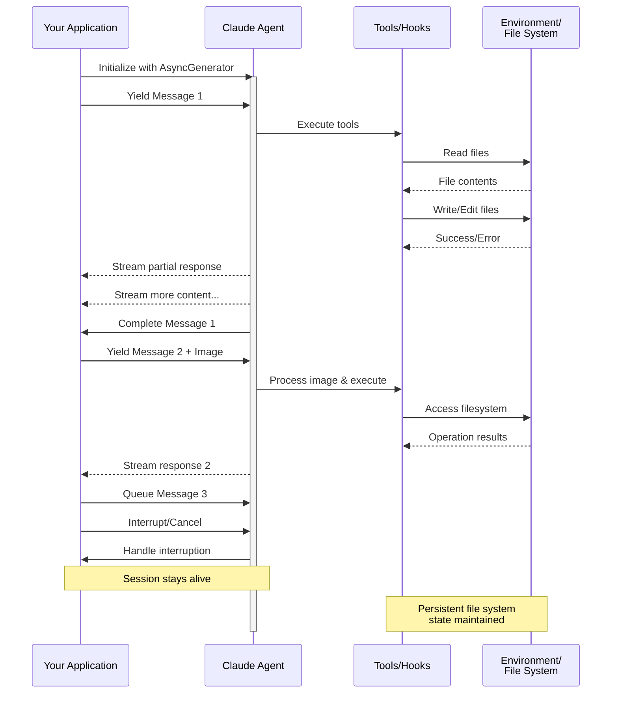

> ## Documentation Index
> Fetch the complete documentation index at: https://code.claude.com/docs/llms.txt
> Use this file to discover all available pages before exploring further.

# Streaming Input

> Comprendre les deux modes d'entrée du Claude Agent SDK et quand utiliser chacun

<h2 id="overview">
  Aperçu
</h2>

Le Claude Agent SDK prend en charge deux modes d'entrée distincts pour interagir avec les agents :

* **Mode Streaming Input** (Par défaut et recommandé) - Une session persistante et interactive
* **Single Message Input** - Des requêtes ponctuelles qui utilisent l'état de la session et la reprise

Ce guide explique les différences, les avantages et les cas d'usage de chaque mode pour vous aider à choisir la bonne approche pour votre application.

<h2 id="streaming-input-mode-recommended">
  Mode Streaming Input (Recommandé)
</h2>

Le mode streaming input est la façon **préférée** d'utiliser le Claude Agent SDK. Il fournit un accès complet aux capacités de l'agent et permet des expériences riches et interactives.

Il permet à l'agent de fonctionner comme un processus de longue durée qui accepte les entrées utilisateur, gère les interruptions, affiche les demandes de permission et gère la gestion de session.

<h3 id="how-it-works">
  Fonctionnement
</h3>



<h3 id="benefits">
  Avantages
</h3>

<CardGroup cols={2}>
  <Card title="Téléchargements d'images" icon="image">
    Joignez des images directement aux messages pour l'analyse et la compréhension visuelles
  </Card>

  <Card title="Messages en file d'attente" icon="stack">
    Envoyez plusieurs messages qui se traitent séquentiellement, avec la possibilité d'interrompre
  </Card>

  <Card title="Intégration d'outils" icon="wrench">
    Accès complet à tous les outils et serveurs MCP personnalisés pendant la session
  </Card>

  <Card title="Retours en temps réel" icon="lightning">
    Voyez les réponses au fur et à mesure qu'elles sont générées, pas seulement les résultats finaux
  </Card>

  <Card title="Persistance du contexte" icon="database">
    Maintenez le contexte de la conversation sur plusieurs tours naturellement
  </Card>
</CardGroup>

<h3 id="implementation-example">
  Exemple d'implémentation
</h3>

<CodeGroup>
  ```typescript TypeScript theme={null}
  import { query, type SDKUserMessage } from "@anthropic-ai/claude-agent-sdk";
  import { readFile } from "fs/promises";

  async function* generateMessages(): AsyncGenerator<SDKUserMessage> {
    // First message
    yield {
      type: "user",
      message: {
        role: "user",
        content: "Analyze this codebase for security issues"
      },
      parent_tool_use_id: null
    };

    // Wait for conditions or user input
    await new Promise((resolve) => setTimeout(resolve, 2000));

    // Follow-up with image
    yield {
      type: "user",
      message: {
        role: "user",
        content: [
          {
            type: "text",
            text: "Review this architecture diagram"
          },
          {
            type: "image",
            source: {
              type: "base64",
              media_type: "image/png",
              data: await readFile("diagram.png", "base64")
            }
          }
        ]
      },
      parent_tool_use_id: null
    };
  }

  // Process streaming responses
  for await (const message of query({
    prompt: generateMessages(),
    options: {
      maxTurns: 10,
      allowedTools: ["Read", "Grep"]
    }
  })) {
    if (message.type === "result" && message.subtype === "success") {
      console.log(message.result);
    }
  }
  ```

  ```python Python theme={null}
  from claude_agent_sdk import (
      ClaudeSDKClient,
      ClaudeAgentOptions,
      AssistantMessage,
      TextBlock,
  )
  import asyncio
  import base64


  async def streaming_analysis():
      async def message_generator():
          # First message
          yield {
              "type": "user",
              "message": {
                  "role": "user",
                  "content": "Analyze this codebase for security issues",
              },
          }

          # Wait for conditions
          await asyncio.sleep(2)

          # Follow-up with image
          with open("diagram.png", "rb") as f:
              image_data = base64.b64encode(f.read()).decode()

          yield {
              "type": "user",
              "message": {
                  "role": "user",
                  "content": [
                      {"type": "text", "text": "Review this architecture diagram"},
                      {
                          "type": "image",
                          "source": {
                              "type": "base64",
                              "media_type": "image/png",
                              "data": image_data,
                          },
                      },
                  ],
              },
          }

      # Use ClaudeSDKClient for streaming input
      options = ClaudeAgentOptions(max_turns=10, allowed_tools=["Read", "Grep"])

      async with ClaudeSDKClient(options) as client:
          # Send streaming input
          await client.query(message_generator())

          # Process responses
          async for message in client.receive_response():
              if isinstance(message, AssistantMessage):
                  for block in message.content:
                      if isinstance(block, TextBlock):
                          print(block.text)


  asyncio.run(streaming_analysis())
  ```
</CodeGroup>

<Note>
  Dans le SDK TypeScript, si votre générateur de messages lève une exception, par exemple lorsqu'un fichier qu'il lit est manquant, le flux se termine par une erreur qui lit « Claude Code process aborted by user » au lieu de l'erreur d'origine, donc vérifiez d'abord le code à l'intérieur de votre générateur lorsque vous voyez ce message. L'erreur peut également être précédée par une longue ligne minifiée du code source du SDK groupé, donc lisez jusqu'à la fin de la sortie pour le texte d'erreur.

  Dans le SDK Python, une exception du générateur est enregistrée au niveau du débogage et la session s'arrête sans lever, donc si une session de streaming se bloque sans sortie, activez la journalisation du débogage et vérifiez votre générateur.
</Note>

<h2 id="single-message-input">
  Entrée de message unique
</h2>

L'entrée de message unique est plus simple mais plus limitée.

<h3 id="when-to-use-single-message-input">
  Quand utiliser l'entrée de message unique
</h3>

Utilisez l'entrée de message unique quand :

* Vous avez besoin d'une réponse ponctuelle
* Vous n'avez pas besoin de pièces jointes d'images ou de méthodes de contrôle en milieu de session
* Vous devez opérer dans un environnement sans état, comme une fonction lambda

<h3 id="limitations">
  Limitations
</h3>

<Warning>
  Le mode d'entrée de message unique ne prend **pas** en charge :

  * Les pièces jointes d'images directes dans les messages
  * La mise en file d'attente dynamique de messages
  * L'interruption en temps réel
  * Les conversations multi-tours naturelles
</Warning>

Si une requête se termine par un résultat d'erreur, tel que `error_max_turns`, un appel unique `query()` lève une erreur qui inclut le texte d'échec après avoir cédé le message de résultat final, donc enveloppez la boucle dans un bloc try si votre code doit continuer. Consultez [Gérer le résultat](/docs/fr/agent-sdk/agent-loop#handle-the-result) pour les sous-types de résultat.

<h3 id="implementation-example-1">
  Exemple d'implémentation
</h3>

<CodeGroup>
  ```typescript TypeScript theme={null}
  import { query } from "@anthropic-ai/claude-agent-sdk";

  // Simple one-shot query
  for await (const message of query({
    prompt: "Explain the authentication flow",
    options: {
      maxTurns: 1,
      allowedTools: ["Read", "Grep"]
    }
  })) {
    if (message.type === "result" && message.subtype === "success") {
      console.log(message.result);
    }
  }

  // Continue conversation with session management
  for await (const message of query({
    prompt: "Now explain the authorization process",
    options: {
      continue: true,
      maxTurns: 1
    }
  })) {
    if (message.type === "result" && message.subtype === "success") {
      console.log(message.result);
    }
  }
  ```

  ```python Python theme={null}
  from claude_agent_sdk import query, ClaudeAgentOptions, ResultMessage
  import asyncio


  async def single_message_example():
      # Simple one-shot query using query() function
      async for message in query(
          prompt="Explain the authentication flow",
          options=ClaudeAgentOptions(max_turns=1, allowed_tools=["Read", "Grep"]),
      ):
          if isinstance(message, ResultMessage):
              print(message.result)

      # Continue conversation with session management
      async for message in query(
          prompt="Now explain the authorization process",
          options=ClaudeAgentOptions(continue_conversation=True, max_turns=1),
      ):
          if isinstance(message, ResultMessage):
              print(message.result)


  asyncio.run(single_message_example())
  ```
</CodeGroup>
