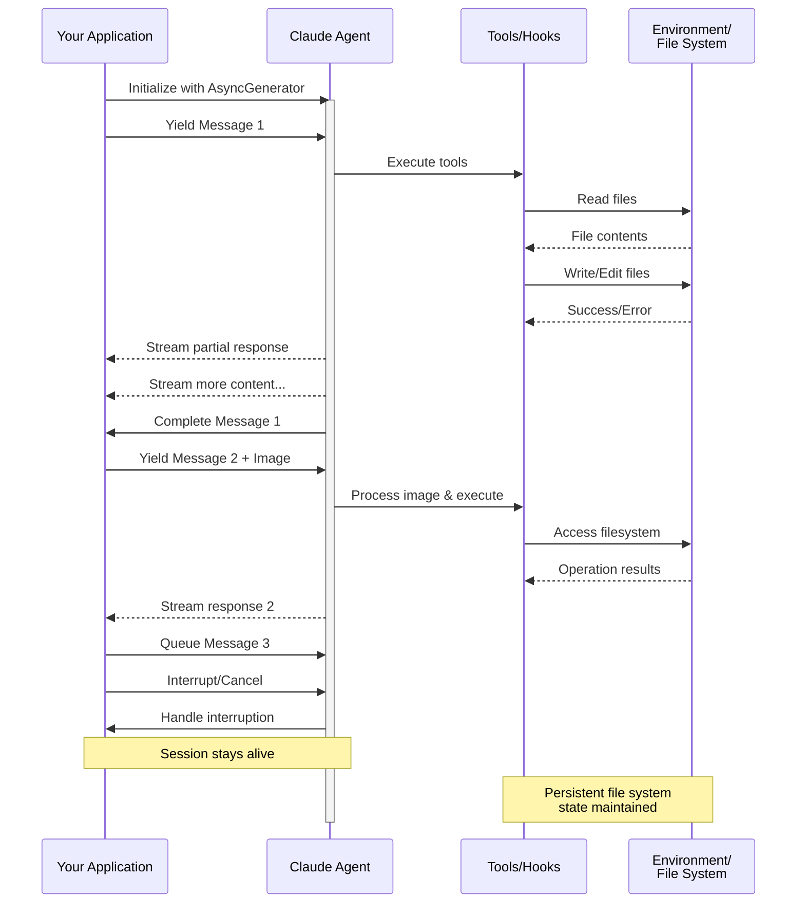

> ## Documentation Index
> Fetch the complete documentation index at: https://code.claude.com/docs/llms.txt
> Use this file to discover all available pages before exploring further.

# Streaming Input

> Memahami dua mode input untuk Claude Agent SDK dan kapan menggunakan masing-masing

<h2 id="overview">
  Gambaran Umum
</h2>

Claude Agent SDK mendukung dua mode input yang berbeda untuk berinteraksi dengan agen:

* **Streaming Input Mode** (Default & Direkomendasikan) - Sesi interaktif yang persisten
* **Single Message Input** - Kueri sekali jalan yang menggunakan status sesi dan melanjutkan

Panduan ini menjelaskan perbedaan, manfaat, dan kasus penggunaan untuk setiap mode untuk membantu Anda memilih pendekatan yang tepat untuk aplikasi Anda.

<h2 id="streaming-input-mode-recommended">
  Streaming Input Mode (Direkomendasikan)
</h2>

Streaming input mode adalah cara yang **lebih disukai** untuk menggunakan Claude Agent SDK. Mode ini memberikan akses penuh ke kemampuan agen dan memungkinkan pengalaman interaktif yang kaya.

Mode ini memungkinkan agen beroperasi sebagai proses yang berumur panjang yang menerima input pengguna, menangani gangguan, menampilkan permintaan izin, dan menangani manajemen sesi.

<h3 id="how-it-works">
  Cara Kerjanya
</h3>



<h3 id="benefits">
  Manfaat
</h3>

<CardGroup cols={2}>
  <Card title="Unggahan Gambar" icon="image">
    Lampirkan gambar langsung ke pesan untuk analisis visual dan pemahaman
  </Card>

  <Card title="Pesan Antrian" icon="stack">
    Kirim beberapa pesan yang diproses secara berurutan, dengan kemampuan untuk mengganggu
  </Card>

  <Card title="Integrasi Tool" icon="wrench">
    Akses penuh ke semua tools dan server MCP kustom selama sesi
  </Card>

  <Card title="Umpan Balik Real-time" icon="lightning">
    Lihat respons saat dihasilkan, bukan hanya hasil akhir
  </Card>

  <Card title="Persistensi Konteks" icon="database">
    Pertahankan konteks percakapan di beberapa giliran secara alami
  </Card>
</CardGroup>

<h3 id="implementation-example">
  Contoh Implementasi
</h3>

<CodeGroup>
  ```typescript TypeScript theme={null}
  import { query, type SDKUserMessage } from "@anthropic-ai/claude-agent-sdk";
  import { readFile } from "fs/promises";

  async function* generateMessages(): AsyncGenerator<SDKUserMessage> {
    // First message
    yield {
      type: "user",
      message: {
        role: "user",
        content: "Analyze this codebase for security issues"
      },
      parent_tool_use_id: null
    };

    // Wait for conditions or user input
    await new Promise((resolve) => setTimeout(resolve, 2000));

    // Follow-up with image
    yield {
      type: "user",
      message: {
        role: "user",
        content: [
          {
            type: "text",
            text: "Review this architecture diagram"
          },
          {
            type: "image",
            source: {
              type: "base64",
              media_type: "image/png",
              data: await readFile("diagram.png", "base64")
            }
          }
        ]
      },
      parent_tool_use_id: null
    };
  }

  // Process streaming responses
  for await (const message of query({
    prompt: generateMessages(),
    options: {
      maxTurns: 10,
      allowedTools: ["Read", "Grep"]
    }
  })) {
    if (message.type === "result" && message.subtype === "success") {
      console.log(message.result);
    }
  }
  ```

  ```python Python theme={null}
  from claude_agent_sdk import (
      ClaudeSDKClient,
      ClaudeAgentOptions,
      AssistantMessage,
      TextBlock,
  )
  import asyncio
  import base64


  async def streaming_analysis():
      async def message_generator():
          # First message
          yield {
              "type": "user",
              "message": {
                  "role": "user",
                  "content": "Analyze this codebase for security issues",
              },
          }

          # Wait for conditions
          await asyncio.sleep(2)

          # Follow-up with image
          with open("diagram.png", "rb") as f:
              image_data = base64.b64encode(f.read()).decode()

          yield {
              "type": "user",
              "message": {
                  "role": "user",
                  "content": [
                      {"type": "text", "text": "Review this architecture diagram"},
                      {
                          "type": "image",
                          "source": {
                              "type": "base64",
                              "media_type": "image/png",
                              "data": image_data,
                          },
                      },
                  ],
              },
          }

      # Use ClaudeSDKClient for streaming input
      options = ClaudeAgentOptions(max_turns=10, allowed_tools=["Read", "Grep"])

      async with ClaudeSDKClient(options) as client:
          # Send streaming input
          await client.query(message_generator())

          # Process responses
          async for message in client.receive_response():
              if isinstance(message, AssistantMessage):
                  for block in message.content:
                      if isinstance(block, TextBlock):
                          print(block.text)


  asyncio.run(streaming_analysis())
  ```
</CodeGroup>

<Note>
  Dalam TypeScript SDK, jika generator pesan Anda melempar kesalahan, misalnya ketika file yang dibacanya hilang, aliran berakhir dengan kesalahan yang berbunyi `Claude Code process aborted by user` alih-alih kesalahan asli, jadi periksa kode di dalam generator Anda terlebih dahulu ketika Anda melihat pesan itu. Kesalahan juga dapat didahului oleh baris minified panjang dari sumber SDK bundel, jadi baca hingga akhir output untuk teks kesalahan.

  Dalam Python SDK, pengecualian generator dicatat pada tingkat debug dan sesi macet tanpa menaikkan, jadi jika sesi streaming tergantung tanpa output, aktifkan logging debug dan periksa generator Anda.
</Note>

<h2 id="single-message-input">
  Single Message Input
</h2>

Single message input lebih sederhana tetapi lebih terbatas.

<h3 id="when-to-use-single-message-input">
  Kapan Menggunakan Single Message Input
</h3>

Gunakan single message input ketika:

* Anda membutuhkan respons sekali jalan
* Anda tidak memerlukan lampiran gambar atau metode kontrol mid-session
* Anda perlu beroperasi di lingkungan stateless, seperti fungsi lambda

<h3 id="limitations">
  Keterbatasan
</h3>

<Warning>
  Single message input mode **tidak** mendukung:

  * Lampiran gambar langsung dalam pesan
  * Antrian pesan dinamis
  * Gangguan real-time
  * Percakapan multi-turn alami
</Warning>

Jika kueri berakhir dengan hasil kesalahan, seperti `error_max_turns`, panggilan `query()` pesan tunggal akan memunculkan kesalahan yang mencakup teks kegagalan setelah menghasilkan pesan hasil akhir, jadi bungkus loop dalam blok try jika kode Anda perlu melanjutkan. Lihat [Handle the result](/docs/id/agent-sdk/agent-loop#handle-the-result) untuk subtipe hasil.

<h3 id="implementation-example-1">
  Contoh Implementasi
</h3>

<CodeGroup>
  ```typescript TypeScript theme={null}
  import { query } from "@anthropic-ai/claude-agent-sdk";

  // Simple one-shot query
  for await (const message of query({
    prompt: "Explain the authentication flow",
    options: {
      maxTurns: 1,
      allowedTools: ["Read", "Grep"]
    }
  })) {
    if (message.type === "result" && message.subtype === "success") {
      console.log(message.result);
    }
  }

  // Continue conversation with session management
  for await (const message of query({
    prompt: "Now explain the authorization process",
    options: {
      continue: true,
      maxTurns: 1
    }
  })) {
    if (message.type === "result" && message.subtype === "success") {
      console.log(message.result);
    }
  }
  ```

  ```python Python theme={null}
  from claude_agent_sdk import query, ClaudeAgentOptions, ResultMessage
  import asyncio


  async def single_message_example():
      # Simple one-shot query using query() function
      async for message in query(
          prompt="Explain the authentication flow",
          options=ClaudeAgentOptions(max_turns=1, allowed_tools=["Read", "Grep"]),
      ):
          if isinstance(message, ResultMessage):
              print(message.result)

      # Continue conversation with session management
      async for message in query(
          prompt="Now explain the authorization process",
          options=ClaudeAgentOptions(continue_conversation=True, max_turns=1),
      ):
          if isinstance(message, ResultMessage):
              print(message.result)


  asyncio.run(single_message_example())
  ```
</CodeGroup>
