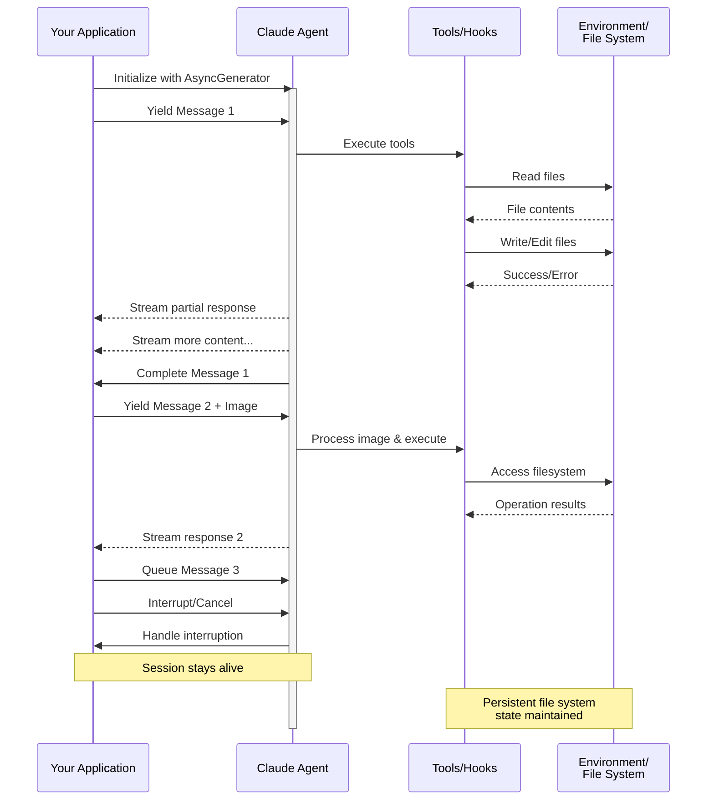

> ## Documentation Index
> Fetch the complete documentation index at: https://code.claude.com/docs/llms.txt
> Use this file to discover all available pages before exploring further.

# Streaming Input

> Comprensione delle due modalità di input per Claude Agent SDK e quando utilizzare ciascuna

<h2 id="overview">
  Panoramica
</h2>

Claude Agent SDK supporta due modalità di input distinte per interagire con gli agenti:

* **Modalità Streaming Input** (Predefinita e Consigliata) - Una sessione persistente e interattiva
* **Single Message Input** - Query una tantum che utilizzano lo stato della sessione e la ripresa

Questa guida spiega le differenze, i vantaggi e i casi d'uso per ciascuna modalità per aiutarvi a scegliere l'approccio giusto per la vostra applicazione.

<h2 id="streaming-input-mode-recommended">
  Modalità Streaming Input (Consigliata)
</h2>

La modalità streaming input è il modo **preferito** per utilizzare Claude Agent SDK. Fornisce accesso completo alle capacità dell'agente e consente esperienze ricche e interattive.

Consente all'agente di operare come un processo di lunga durata che accetta input dell'utente, gestisce interruzioni, visualizza richieste di autorizzazione e gestisce la gestione della sessione.

<h3 id="how-it-works">
  Come Funziona
</h3>



<h3 id="benefits">
  Vantaggi
</h3>

<CardGroup cols={2}>
  <Card title="Caricamenti di Immagini" icon="image">
    Allegate immagini direttamente ai messaggi per l'analisi visiva e la comprensione
  </Card>

  <Card title="Messaggi in Coda" icon="stack">
    Inviate più messaggi che vengono elaborati sequenzialmente, con la possibilità di interrompere
  </Card>

  <Card title="Integrazione Tool" icon="wrench">
    Accesso completo a tutti i tool e ai server MCP personalizzati durante la sessione
  </Card>

  <Card title="Feedback in Tempo Reale" icon="lightning">
    Vedete le risposte mentre vengono generate, non solo i risultati finali
  </Card>

  <Card title="Persistenza del Contesto" icon="database">
    Mantenete il contesto della conversazione su più turni naturalmente
  </Card>
</CardGroup>

<h3 id="implementation-example">
  Esempio di Implementazione
</h3>

<CodeGroup>
  ```typescript TypeScript theme={null}
  import { query, type SDKUserMessage } from "@anthropic-ai/claude-agent-sdk";
  import { readFile } from "fs/promises";

  async function* generateMessages(): AsyncGenerator<SDKUserMessage> {
    // First message
    yield {
      type: "user",
      message: {
        role: "user",
        content: "Analyze this codebase for security issues"
      },
      parent_tool_use_id: null
    };

    // Wait for conditions or user input
    await new Promise((resolve) => setTimeout(resolve, 2000));

    // Follow-up with image
    yield {
      type: "user",
      message: {
        role: "user",
        content: [
          {
            type: "text",
            text: "Review this architecture diagram"
          },
          {
            type: "image",
            source: {
              type: "base64",
              media_type: "image/png",
              data: await readFile("diagram.png", "base64")
            }
          }
        ]
      },
      parent_tool_use_id: null
    };
  }

  // Process streaming responses
  for await (const message of query({
    prompt: generateMessages(),
    options: {
      maxTurns: 10,
      allowedTools: ["Read", "Grep"]
    }
  })) {
    if (message.type === "result" && message.subtype === "success") {
      console.log(message.result);
    }
  }
  ```

  ```python Python theme={null}
  from claude_agent_sdk import (
      ClaudeSDKClient,
      ClaudeAgentOptions,
      AssistantMessage,
      TextBlock,
  )
  import asyncio
  import base64


  async def streaming_analysis():
      async def message_generator():
          # First message
          yield {
              "type": "user",
              "message": {
                  "role": "user",
                  "content": "Analyze this codebase for security issues",
              },
          }

          # Wait for conditions
          await asyncio.sleep(2)

          # Follow-up with image
          with open("diagram.png", "rb") as f:
              image_data = base64.b64encode(f.read()).decode()

          yield {
              "type": "user",
              "message": {
                  "role": "user",
                  "content": [
                      {"type": "text", "text": "Review this architecture diagram"},
                      {
                          "type": "image",
                          "source": {
                              "type": "base64",
                              "media_type": "image/png",
                              "data": image_data,
                          },
                      },
                  ],
              },
          }

      # Use ClaudeSDKClient for streaming input
      options = ClaudeAgentOptions(max_turns=10, allowed_tools=["Read", "Grep"])

      async with ClaudeSDKClient(options) as client:
          # Send streaming input
          await client.query(message_generator())

          # Process responses
          async for message in client.receive_response():
              if isinstance(message, AssistantMessage):
                  for block in message.content:
                      if isinstance(block, TextBlock):
                          print(block.text)


  asyncio.run(streaming_analysis())
  ```
</CodeGroup>

<Note>
  In TypeScript SDK, se il vostro generatore di messaggi genera un'eccezione, ad esempio quando un file che legge è mancante, il flusso termina con un errore che recita `Claude Code process aborted by user` invece dell'errore originale, quindi controllate il codice all'interno del vostro generatore per primo quando vedete quel messaggio. L'errore potrebbe anche essere preceduto da una lunga riga minificata del codice sorgente SDK raggruppato, quindi leggete fino alla fine dell'output per il testo dell'errore.

  In Python SDK, un'eccezione del generatore viene registrata a livello di debug e la sessione si blocca senza sollevare, quindi se una sessione di streaming si blocca senza output, abilitate la registrazione di debug e controllate il vostro generatore.
</Note>

<h2 id="single-message-input">
  Single Message Input
</h2>

Single message input è più semplice ma più limitato.

<h3 id="when-to-use-single-message-input">
  Quando Utilizzare Single Message Input
</h3>

Utilizzate single message input quando:

* Avete bisogno di una risposta una tantum
* Non avete bisogno di allegati di immagini o metodi di controllo mid-session
* Dovete operare in un ambiente senza stato, come una funzione lambda

<h3 id="limitations">
  Limitazioni
</h3>

<Warning>
  La modalità single message input **non** supporta:

  * Allegati di immagini diretti nei messaggi
  * Accodamento dinamico dei messaggi
  * Interruzione in tempo reale
  * Conversazioni multi-turno naturali
</Warning>

Se una query termina con un risultato di errore, come `error_max_turns`, una singola chiamata `query()` genera un errore che include il testo dell'errore dopo aver restituito il messaggio di risultato finale, quindi avvolgete il ciclo in un blocco try se il vostro codice deve continuare. Consultate [Gestire il risultato](/docs/it/agent-sdk/agent-loop#handle-the-result) per i sottotipi di risultato.

<h3 id="implementation-example-1">
  Esempio di Implementazione
</h3>

<CodeGroup>
  ```typescript TypeScript theme={null}
  import { query } from "@anthropic-ai/claude-agent-sdk";

  // Simple one-shot query
  for await (const message of query({
    prompt: "Explain the authentication flow",
    options: {
      maxTurns: 1,
      allowedTools: ["Read", "Grep"]
    }
  })) {
    if (message.type === "result" && message.subtype === "success") {
      console.log(message.result);
    }
  }

  // Continue conversation with session management
  for await (const message of query({
    prompt: "Now explain the authorization process",
    options: {
      continue: true,
      maxTurns: 1
    }
  })) {
    if (message.type === "result" && message.subtype === "success") {
      console.log(message.result);
    }
  }
  ```

  ```python Python theme={null}
  from claude_agent_sdk import query, ClaudeAgentOptions, ResultMessage
  import asyncio


  async def single_message_example():
      # Simple one-shot query using query() function
      async for message in query(
          prompt="Explain the authentication flow",
          options=ClaudeAgentOptions(max_turns=1, allowed_tools=["Read", "Grep"]),
      ):
          if isinstance(message, ResultMessage):
              print(message.result)

      # Continue conversation with session management
      async for message in query(
          prompt="Now explain the authorization process",
          options=ClaudeAgentOptions(continue_conversation=True, max_turns=1),
      ):
          if isinstance(message, ResultMessage):
              print(message.result)


  asyncio.run(single_message_example())
  ```
</CodeGroup>
