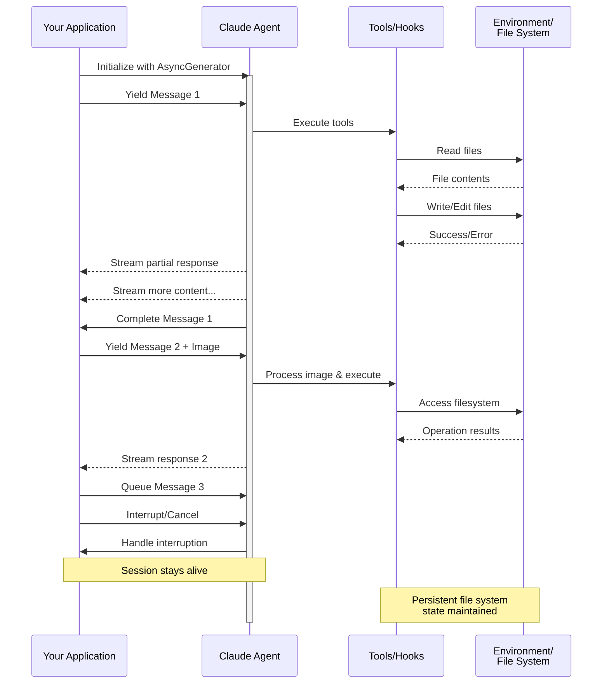

> ## Documentation Index
> Fetch the complete documentation index at: https://code.claude.com/docs/llms.txt
> Use this file to discover all available pages before exploring further.

# ストリーミング入力

> Claude Agent SDK の 2 つの入力モードを理解し、各モードをいつ使用するかを学ぶ

<h2 id="overview">
  概要
</h2>

Claude Agent SDK は、エージェントと対話するための 2 つの異なる入力モードをサポートしています。

* **ストリーミング入力モード**（デフォルト＆推奨）- 永続的でインタラクティブなセッション
* **シングルメッセージ入力** - セッション状態を使用して再開する 1 回限りのクエリ

このガイドでは、各モードの違い、利点、ユースケースについて説明し、アプリケーションに適したアプローチを選択するのに役立てます。

<h2 id="streaming-input-mode-recommended">
  ストリーミング入力モード（推奨）
</h2>

ストリーミング入力モードは、Claude Agent SDK を使用する**推奨される**方法です。エージェントの機能へのフルアクセスを提供し、豊かでインタラクティブなエクスペリエンスを実現します。

エージェントが長期間実行されるプロセスとして動作し、ユーザー入力を受け取り、割り込みを処理し、権限リクエストを表示し、セッション管理を処理することができます。

<h3 id="how-it-works">
  仕組み
</h3>



<h3 id="benefits">
  利点
</h3>

<CardGroup cols={2}>
  <Card title="画像アップロード" icon="image">
    メッセージに画像を直接添付して、ビジュアル分析と理解を実現
  </Card>

  <Card title="キューに入れたメッセージ" icon="stack">
    複数のメッセージを順序立てて処理し、割り込み機能を備えて送信
  </Card>

  <Card title="ツール統合" icon="wrench">
    セッション中にすべてのツールとカスタム MCP サーバーへのフルアクセスをサポート
  </Card>

  <Card title="リアルタイムフィードバック" icon="lightning">
    最終結果だけでなく、生成されたレスポンスをリアルタイムで確認
  </Card>

  <Card title="コンテキスト永続性" icon="database">
    複数のターンにわたって自然に会話コンテキストを維持
  </Card>
</CardGroup>

<h3 id="implementation-example">
  実装例
</h3>

<CodeGroup>
  ```typescript TypeScript theme={null}
  import { query, type SDKUserMessage } from "@anthropic-ai/claude-agent-sdk";
  import { readFile } from "fs/promises";

  async function* generateMessages(): AsyncGenerator<SDKUserMessage> {
    // First message
    yield {
      type: "user",
      message: {
        role: "user",
        content: "Analyze this codebase for security issues"
      },
      parent_tool_use_id: null
    };

    // Wait for conditions or user input
    await new Promise((resolve) => setTimeout(resolve, 2000));

    // Follow-up with image
    yield {
      type: "user",
      message: {
        role: "user",
        content: [
          {
            type: "text",
            text: "Review this architecture diagram"
          },
          {
            type: "image",
            source: {
              type: "base64",
              media_type: "image/png",
              data: await readFile("diagram.png", "base64")
            }
          }
        ]
      },
      parent_tool_use_id: null
    };
  }

  // Process streaming responses
  for await (const message of query({
    prompt: generateMessages(),
    options: {
      maxTurns: 10,
      allowedTools: ["Read", "Grep"]
    }
  })) {
    if (message.type === "result" && message.subtype === "success") {
      console.log(message.result);
    }
  }
  ```

  ```python Python theme={null}
  from claude_agent_sdk import (
      ClaudeSDKClient,
      ClaudeAgentOptions,
      AssistantMessage,
      TextBlock,
  )
  import asyncio
  import base64


  async def streaming_analysis():
      async def message_generator():
          # First message
          yield {
              "type": "user",
              "message": {
                  "role": "user",
                  "content": "Analyze this codebase for security issues",
              },
          }

          # Wait for conditions
          await asyncio.sleep(2)

          # Follow-up with image
          with open("diagram.png", "rb") as f:
              image_data = base64.b64encode(f.read()).decode()

          yield {
              "type": "user",
              "message": {
                  "role": "user",
                  "content": [
                      {"type": "text", "text": "Review this architecture diagram"},
                      {
                          "type": "image",
                          "source": {
                              "type": "base64",
                              "media_type": "image/png",
                              "data": image_data,
                          },
                      },
                  ],
              },
          }

      # Use ClaudeSDKClient for streaming input
      options = ClaudeAgentOptions(max_turns=10, allowed_tools=["Read", "Grep"])

      async with ClaudeSDKClient(options) as client:
          # Send streaming input
          await client.query(message_generator())

          # Process responses
          async for message in client.receive_response():
              if isinstance(message, AssistantMessage):
                  for block in message.content:
                      if isinstance(block, TextBlock):
                          print(block.text)


  asyncio.run(streaming_analysis())
  ```
</CodeGroup>

<Note>
  TypeScript SDK では、例えば読み込むファイルが見つからない場合など、メッセージジェネレータが例外をスローすると、ストリームは元のエラーではなく「Claude Code process aborted by user」というエラーで終了するため、そのメッセージが表示された場合は、まずジェネレータ内のコードを確認してください。エラーの前に、バンドルされた SDK ソースの長い縮小化された行が表示される場合もあるため、出力の最後まで読んでエラーテキストを確認してください。

  Python SDK では、ジェネレータの例外はデバッグレベルでログに記録され、セッションは例外を発生させずにスタールします。そのため、ストリーミングセッションが出力なくハングする場合は、デバッグログを有効にしてジェネレータを確認してください。
</Note>

<h2 id="single-message-input">
  シングルメッセージ入力
</h2>

シングルメッセージ入力はより単純ですが、より制限されています。

<h3 id="when-to-use-single-message-input">
  シングルメッセージ入力を使用する場合
</h3>

シングルメッセージ入力は以下の場合に使用してください。

* 1 回限りのレスポンスが必要な場合
* 画像添付またはセッション中の制御メソッドが不要な場合
* Lambda 関数などのステートレス環境で動作する必要がある場合

<h3 id="limitations">
  制限事項
</h3>

<Warning>
  シングルメッセージ入力モードは以下をサポート**していません**。

  * メッセージ内の直接的な画像添付
  * 動的なメッセージキューイング
  * リアルタイム割り込み
  * 自然なマルチターン会話
</Warning>

クエリが `error_max_turns` などのエラー結果で終了する場合、シングルメッセージの `query()` 呼び出しは最終結果メッセージを生成した後、失敗テキストを含むエラーを発生させます。コードが続行する必要がある場合は、ループを try ブロックでラップしてください。結果サブタイプについては、[結果を処理する](/docs/ja/agent-sdk/agent-loop#handle-the-result)を参照してください。

<h3 id="implementation-example-1">
  実装例
</h3>

<CodeGroup>
  ```typescript TypeScript theme={null}
  import { query } from "@anthropic-ai/claude-agent-sdk";

  // Simple one-shot query
  for await (const message of query({
    prompt: "Explain the authentication flow",
    options: {
      maxTurns: 1,
      allowedTools: ["Read", "Grep"]
    }
  })) {
    if (message.type === "result" && message.subtype === "success") {
      console.log(message.result);
    }
  }

  // Continue conversation with session management
  for await (const message of query({
    prompt: "Now explain the authorization process",
    options: {
      continue: true,
      maxTurns: 1
    }
  })) {
    if (message.type === "result" && message.subtype === "success") {
      console.log(message.result);
    }
  }
  ```

  ```python Python theme={null}
  from claude_agent_sdk import query, ClaudeAgentOptions, ResultMessage
  import asyncio


  async def single_message_example():
      # Simple one-shot query using query() function
      async for message in query(
          prompt="Explain the authentication flow",
          options=ClaudeAgentOptions(max_turns=1, allowed_tools=["Read", "Grep"]),
      ):
          if isinstance(message, ResultMessage):
              print(message.result)

      # Continue conversation with session management
      async for message in query(
          prompt="Now explain the authorization process",
          options=ClaudeAgentOptions(continue_conversation=True, max_turns=1),
      ):
          if isinstance(message, ResultMessage):
              print(message.result)


  asyncio.run(single_message_example())
  ```
</CodeGroup>
