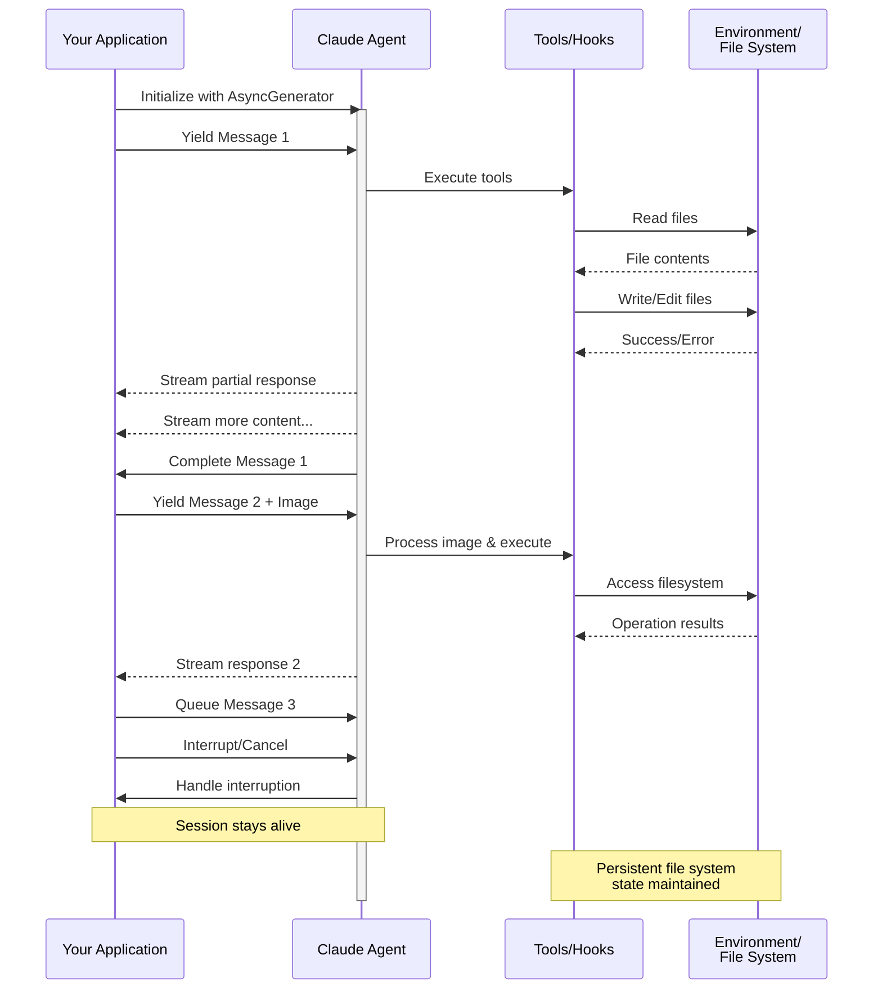

> ## Documentation Index
> Fetch the complete documentation index at: https://code.claude.com/docs/llms.txt
> Use this file to discover all available pages before exploring further.

# Streaming Input

> Compreendendo os dois modos de entrada para Claude Agent SDK e quando usar cada um

<h2 id="overview">
  Visão Geral
</h2>

O Claude Agent SDK suporta dois modos de entrada distintos para interagir com agentes:

* **Modo Streaming Input** (Padrão e Recomendado) - Uma sessão persistente e interativa
* **Single Message Input** - Consultas únicas que usam estado de sessão e retomada

Este guia explica as diferenças, benefícios e casos de uso para cada modo para ajudá-lo a escolher a abordagem correta para sua aplicação.

<h2 id="streaming-input-mode-recommended">
  Modo Streaming Input (Recomendado)
</h2>

O modo streaming input é a forma **preferida** de usar o Claude Agent SDK. Ele fornece acesso completo aos recursos do agente e permite experiências ricas e interativas.

Ele permite que o agente funcione como um processo de longa duração que recebe entrada do usuário, lida com interrupções, exibe solicitações de permissão e gerencia a sessão.

<h3 id="how-it-works">
  Como Funciona
</h3>



<h3 id="benefits">
  Benefícios
</h3>

<CardGroup cols={2}>
  <Card title="Uploads de Imagens" icon="image">
    Anexe imagens diretamente às mensagens para análise e compreensão visual
  </Card>

  <Card title="Mensagens Enfileiradas" icon="stack">
    Envie múltiplas mensagens que processam sequencialmente, com capacidade de interrupção
  </Card>

  <Card title="Integração de Ferramentas" icon="wrench">
    Acesso completo a todas as ferramentas e servidores MCP personalizados durante a sessão
  </Card>

  <Card title="Feedback em Tempo Real" icon="lightning">
    Veja as respostas conforme são geradas, não apenas os resultados finais
  </Card>

  <Card title="Persistência de Contexto" icon="database">
    Mantenha o contexto da conversa em múltiplos turnos naturalmente
  </Card>
</CardGroup>

<h3 id="implementation-example">
  Exemplo de Implementação
</h3>

<CodeGroup>
  ```typescript TypeScript theme={null}
  import { query, type SDKUserMessage } from "@anthropic-ai/claude-agent-sdk";
  import { readFile } from "fs/promises";

  async function* generateMessages(): AsyncGenerator<SDKUserMessage> {
    // First message
    yield {
      type: "user",
      message: {
        role: "user",
        content: "Analyze this codebase for security issues"
      },
      parent_tool_use_id: null
    };

    // Wait for conditions or user input
    await new Promise((resolve) => setTimeout(resolve, 2000));

    // Follow-up with image
    yield {
      type: "user",
      message: {
        role: "user",
        content: [
          {
            type: "text",
            text: "Review this architecture diagram"
          },
          {
            type: "image",
            source: {
              type: "base64",
              media_type: "image/png",
              data: await readFile("diagram.png", "base64")
            }
          }
        ]
      },
      parent_tool_use_id: null
    };
  }

  // Process streaming responses
  for await (const message of query({
    prompt: generateMessages(),
    options: {
      maxTurns: 10,
      allowedTools: ["Read", "Grep"]
    }
  })) {
    if (message.type === "result" && message.subtype === "success") {
      console.log(message.result);
    }
  }
  ```

  ```python Python theme={null}
  from claude_agent_sdk import (
      ClaudeSDKClient,
      ClaudeAgentOptions,
      AssistantMessage,
      TextBlock,
  )
  import asyncio
  import base64


  async def streaming_analysis():
      async def message_generator():
          # First message
          yield {
              "type": "user",
              "message": {
                  "role": "user",
                  "content": "Analyze this codebase for security issues",
              },
          }

          # Wait for conditions
          await asyncio.sleep(2)

          # Follow-up with image
          with open("diagram.png", "rb") as f:
              image_data = base64.b64encode(f.read()).decode()

          yield {
              "type": "user",
              "message": {
                  "role": "user",
                  "content": [
                      {"type": "text", "text": "Review this architecture diagram"},
                      {
                          "type": "image",
                          "source": {
                              "type": "base64",
                              "media_type": "image/png",
                              "data": image_data,
                          },
                      },
                  ],
              },
          }

      # Use ClaudeSDKClient for streaming input
      options = ClaudeAgentOptions(max_turns=10, allowed_tools=["Read", "Grep"])

      async with ClaudeSDKClient(options) as client:
          # Send streaming input
          await client.query(message_generator())

          # Process responses
          async for message in client.receive_response():
              if isinstance(message, AssistantMessage):
                  for block in message.content:
                      if isinstance(block, TextBlock):
                          print(block.text)


  asyncio.run(streaming_analysis())
  ```
</CodeGroup>

<Note>
  No SDK TypeScript, se seu gerador de mensagens lançar uma exceção, por exemplo quando um arquivo que ele lê está faltando, o stream termina com um erro que diz `Claude Code process aborted by user` em vez do erro original, então verifique o código dentro do seu gerador primeiro quando você vir essa mensagem. O erro também pode ser precedido por uma longa linha minificada do código-fonte do SDK agrupado, então leia até o final da saída para encontrar o texto do erro.

  No SDK Python, uma exceção do gerador é registrada no nível de debug e a sessão trava sem lançar, então se uma sessão de streaming ficar pendurada sem saída, ative o registro de debug e verifique seu gerador.
</Note>

<h2 id="single-message-input">
  Entrada de Mensagem Única
</h2>

A entrada de mensagem única é mais simples, mas mais limitada.

<h3 id="when-to-use-single-message-input">
  Quando Usar Entrada de Mensagem Única
</h3>

Use entrada de mensagem única quando:

* Você precisa de uma resposta única
* Você não precisa de anexos de imagens ou métodos de controle mid-session
* Você precisa operar em um ambiente sem estado, como uma função lambda

<h3 id="limitations">
  Limitações
</h3>

<Warning>
  O modo de entrada de mensagem única **não** suporta:

  * Anexos de imagens diretos em mensagens
  * Enfileiramento dinâmico de mensagens
  * Interrupção em tempo real
  * Conversas naturais com múltiplos turnos
</Warning>

Se uma consulta terminar com um resultado de erro, como `error_max_turns`, uma chamada única de `query()` gera um erro que inclui o texto da falha após gerar a mensagem de resultado final, portanto, envolva o loop em um bloco try se seu código precisar continuar. Consulte [Lidar com o resultado](/docs/pt/agent-sdk/agent-loop#handle-the-result) para os subtipos de resultado.

<h3 id="implementation-example-1">
  Exemplo de Implementação
</h3>

<CodeGroup>
  ```typescript TypeScript theme={null}
  import { query } from "@anthropic-ai/claude-agent-sdk";

  // Simple one-shot query
  for await (const message of query({
    prompt: "Explain the authentication flow",
    options: {
      maxTurns: 1,
      allowedTools: ["Read", "Grep"]
    }
  })) {
    if (message.type === "result" && message.subtype === "success") {
      console.log(message.result);
    }
  }

  // Continue conversation with session management
  for await (const message of query({
    prompt: "Now explain the authorization process",
    options: {
      continue: true,
      maxTurns: 1
    }
  })) {
    if (message.type === "result" && message.subtype === "success") {
      console.log(message.result);
    }
  }
  ```

  ```python Python theme={null}
  from claude_agent_sdk import query, ClaudeAgentOptions, ResultMessage
  import asyncio


  async def single_message_example():
      # Simple one-shot query using query() function
      async for message in query(
          prompt="Explain the authentication flow",
          options=ClaudeAgentOptions(max_turns=1, allowed_tools=["Read", "Grep"]),
      ):
          if isinstance(message, ResultMessage):
              print(message.result)

      # Continue conversation with session management
      async for message in query(
          prompt="Now explain the authorization process",
          options=ClaudeAgentOptions(continue_conversation=True, max_turns=1),
      ):
          if isinstance(message, ResultMessage):
              print(message.result)


  asyncio.run(single_message_example())
  ```
</CodeGroup>
