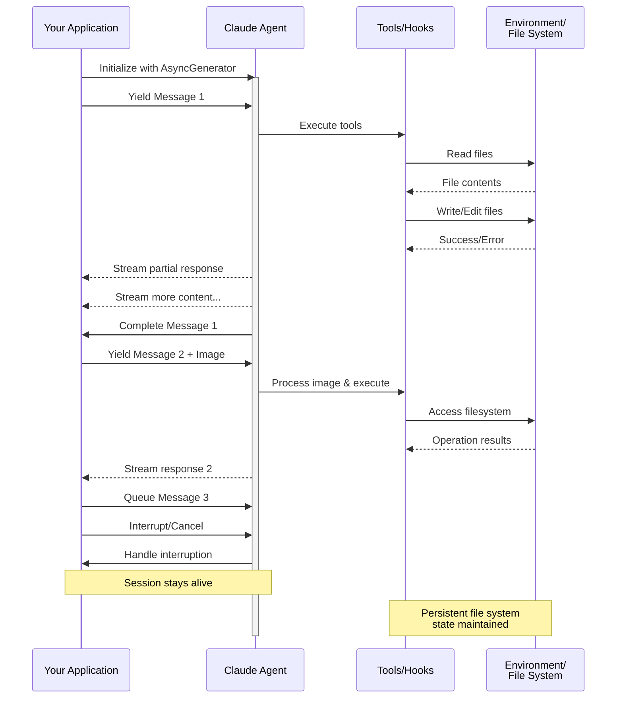

> ## Documentation Index
> Fetch the complete documentation index at: https://code.claude.com/docs/llms.txt
> Use this file to discover all available pages before exploring further.

# Streaming Input

> Понимание двух режимов ввода для Claude Agent SDK и когда использовать каждый

<h2 id="overview">
  Обзор
</h2>

Claude Agent SDK поддерживает два различных режима ввода для взаимодействия с агентами:

* **Режим Streaming Input** (По умолчанию и рекомендуется) - Постоянная интерактивная сессия
* **Single Message Input** - Одноразовые запросы, которые используют состояние сессии и возобновление

Это руководство объясняет различия, преимущества и варианты использования каждого режима, чтобы помочь вам выбрать правильный подход для вашего приложения.

<h2 id="streaming-input-mode-recommended">
  Режим Streaming Input (Рекомендуется)
</h2>

Режим streaming input - это **предпочтительный** способ использования Claude Agent SDK. Он обеспечивает полный доступ к возможностям агента и позволяет создавать богатые интерактивные впечатления.

Он позволяет агенту работать как долгоживущий процесс, который принимает пользовательский ввод, обрабатывает прерывания, выводит запросы разрешений и управляет сессией.

<h3 id="how-it-works">
  Как это работает
</h3>



<h3 id="benefits">
  Преимущества
</h3>

<CardGroup cols={2}>
  <Card title="Загрузка изображений" icon="image">
    Прикрепляйте изображения непосредственно к сообщениям для визуального анализа и понимания
  </Card>

  <Card title="Очередь сообщений" icon="stack">
    Отправляйте несколько сообщений, которые обрабатываются последовательно, с возможностью прерывания
  </Card>

  <Card title="Интеграция инструментов" icon="wrench">
    Полный доступ ко всем инструментам и пользовательским MCP серверам во время сессии
  </Card>

  <Card title="Обратная связь в реальном времени" icon="lightning">
    Смотрите ответы по мере их создания, а не только финальные результаты
  </Card>

  <Card title="Сохранение контекста" icon="database">
    Сохраняйте контекст разговора между несколькими ходами естественным образом
  </Card>
</CardGroup>

<h3 id="implementation-example">
  Пример реализации
</h3>

<CodeGroup>
  ```typescript TypeScript theme={null}
  import { query, type SDKUserMessage } from "@anthropic-ai/claude-agent-sdk";
  import { readFile } from "fs/promises";

  async function* generateMessages(): AsyncGenerator<SDKUserMessage> {
    // First message
    yield {
      type: "user",
      message: {
        role: "user",
        content: "Analyze this codebase for security issues"
      },
      parent_tool_use_id: null
    };

    // Wait for conditions or user input
    await new Promise((resolve) => setTimeout(resolve, 2000));

    // Follow-up with image
    yield {
      type: "user",
      message: {
        role: "user",
        content: [
          {
            type: "text",
            text: "Review this architecture diagram"
          },
          {
            type: "image",
            source: {
              type: "base64",
              media_type: "image/png",
              data: await readFile("diagram.png", "base64")
            }
          }
        ]
      },
      parent_tool_use_id: null
    };
  }

  // Process streaming responses
  for await (const message of query({
    prompt: generateMessages(),
    options: {
      maxTurns: 10,
      allowedTools: ["Read", "Grep"]
    }
  })) {
    if (message.type === "result" && message.subtype === "success") {
      console.log(message.result);
    }
  }
  ```

  ```python Python theme={null}
  from claude_agent_sdk import (
      ClaudeSDKClient,
      ClaudeAgentOptions,
      AssistantMessage,
      TextBlock,
  )
  import asyncio
  import base64


  async def streaming_analysis():
      async def message_generator():
          # First message
          yield {
              "type": "user",
              "message": {
                  "role": "user",
                  "content": "Analyze this codebase for security issues",
              },
          }

          # Wait for conditions
          await asyncio.sleep(2)

          # Follow-up with image
          with open("diagram.png", "rb") as f:
              image_data = base64.b64encode(f.read()).decode()

          yield {
              "type": "user",
              "message": {
                  "role": "user",
                  "content": [
                      {"type": "text", "text": "Review this architecture diagram"},
                      {
                          "type": "image",
                          "source": {
                              "type": "base64",
                              "media_type": "image/png",
                              "data": image_data,
                          },
                      },
                  ],
              },
          }

      # Use ClaudeSDKClient for streaming input
      options = ClaudeAgentOptions(max_turns=10, allowed_tools=["Read", "Grep"])

      async with ClaudeSDKClient(options) as client:
          # Send streaming input
          await client.query(message_generator())

          # Process responses
          async for message in client.receive_response():
              if isinstance(message, AssistantMessage):
                  for block in message.content:
                      if isinstance(block, TextBlock):
                          print(block.text)


  asyncio.run(streaming_analysis())
  ```
</CodeGroup>

<Note>
  В TypeScript SDK, если ваш генератор сообщений выбросит исключение, например, когда файл, который он читает, отсутствует, поток завершится с ошибкой, которая гласит `Claude Code process aborted by user` вместо исходной ошибки, поэтому сначала проверьте код внутри вашего генератора, когда вы видите это сообщение. Ошибке также может предшествовать длинная минифицированная строка объединённого исходного кода SDK, поэтому прочитайте до конца вывода, чтобы найти текст ошибки.

  В Python SDK исключение генератора регистрируется на уровне отладки, и сессия зависает без выброса исключения, поэтому если сессия streaming зависает без вывода, включите логирование отладки и проверьте ваш генератор.
</Note>

<h2 id="single-message-input">
  Ввод одного сообщения
</h2>

Ввод одного сообщения проще, но более ограничен.

<h3 id="when-to-use-single-message-input">
  Когда использовать ввод одного сообщения
</h3>

Используйте ввод одного сообщения когда:

* Вам нужен одноразовый ответ
* Вам не нужны вложения изображений или методы управления в середине сеанса
* Вам нужно работать в безгосударственной среде, такой как lambda функция

<h3 id="limitations">
  Ограничения
</h3>

<Warning>
  Режим ввода одного сообщения **не** поддерживает:

  * Прямое вложение изображений в сообщения
  * Динамическую очередь сообщений
  * Прерывание в реальном времени
  * Естественные многоходовые разговоры
</Warning>

Если запрос заканчивается результатом ошибки, например `error_max_turns`, один вызов `query()` вызывает ошибку, которая включает текст сбоя после выдачи финального сообщения результата, поэтому оберните цикл в блок try, если вашему коду нужно продолжить работу. См. [Обработка результата](/docs/ru/agent-sdk/agent-loop#handle-the-result) для подтипов результатов.

<h3 id="implementation-example-1">
  Пример реализации
</h3>

<CodeGroup>
  ```typescript TypeScript theme={null}
  import { query } from "@anthropic-ai/claude-agent-sdk";

  // Simple one-shot query
  for await (const message of query({
    prompt: "Explain the authentication flow",
    options: {
      maxTurns: 1,
      allowedTools: ["Read", "Grep"]
    }
  })) {
    if (message.type === "result" && message.subtype === "success") {
      console.log(message.result);
    }
  }

  // Continue conversation with session management
  for await (const message of query({
    prompt: "Now explain the authorization process",
    options: {
      continue: true,
      maxTurns: 1
    }
  })) {
    if (message.type === "result" && message.subtype === "success") {
      console.log(message.result);
    }
  }
  ```

  ```python Python theme={null}
  from claude_agent_sdk import query, ClaudeAgentOptions, ResultMessage
  import asyncio


  async def single_message_example():
      # Simple one-shot query using query() function
      async for message in query(
          prompt="Explain the authentication flow",
          options=ClaudeAgentOptions(max_turns=1, allowed_tools=["Read", "Grep"]),
      ):
          if isinstance(message, ResultMessage):
              print(message.result)

      # Continue conversation with session management
      async for message in query(
          prompt="Now explain the authorization process",
          options=ClaudeAgentOptions(continue_conversation=True, max_turns=1),
      ):
          if isinstance(message, ResultMessage):
              print(message.result)


  asyncio.run(single_message_example())
  ```
</CodeGroup>
