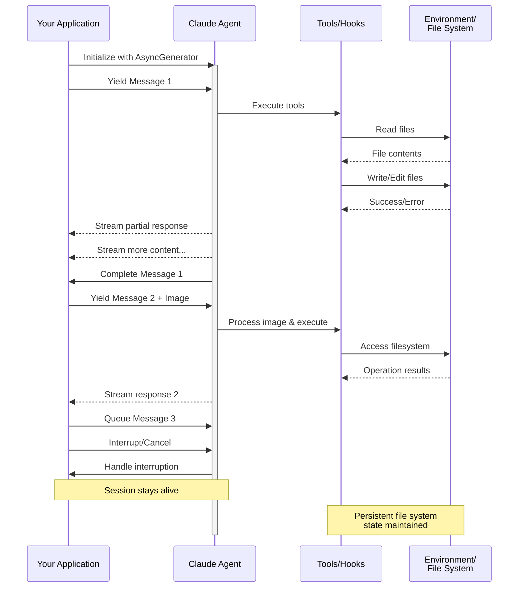

> ## Documentation Index
> Fetch the complete documentation index at: https://code.claude.com/docs/llms.txt
> Use this file to discover all available pages before exploring further.

# 串流輸入

> 了解 Claude Agent SDK 的兩種輸入模式及何時使用各種模式

<h2 id="overview">
  概述
</h2>

Claude Agent SDK 支援兩種不同的輸入模式來與代理互動：

* **串流輸入模式**（預設且推薦）- 持久的互動式工作階段
* **單一訊息輸入** - 使用工作階段狀態和恢復的一次性查詢

本指南說明每種模式的差異、優點和使用案例，幫助您為應用程式選擇正確的方法。

<h2 id="streaming-input-mode-recommended">
  串流輸入模式（推薦）
</h2>

串流輸入模式是使用 Claude Agent SDK 的**首選**方式。它提供對代理功能的完整存取，並啟用豐富的互動式體驗。

它允許代理作為長期執行的程序運作，接收使用者輸入、處理中斷、顯示權限請求，以及處理工作階段管理。

<h3 id="how-it-works">
  運作方式
</h3>



<h3 id="benefits">
  優點
</h3>

<CardGroup cols={2}>
  <Card title="影像上傳" icon="image">
    直接將影像附加到訊息中以進行視覺分析和理解
  </Card>

  <Card title="佇列訊息" icon="stack">
    傳送多個訊息以順序處理，並能夠中斷
  </Card>

  <Card title="工具整合" icon="wrench">
    在工作階段期間完整存取所有工具和自訂 MCP 伺服器
  </Card>

  <Card title="即時回饋" icon="lightning">
    查看產生的回應，而不僅僅是最終結果
  </Card>

  <Card title="內容持久性" icon="database">
    自然地在多個回合中維持對話內容
  </Card>
</CardGroup>

<h3 id="implementation-example">
  實作範例
</h3>

<CodeGroup>
  ```typescript TypeScript theme={null}
  import { query, type SDKUserMessage } from "@anthropic-ai/claude-agent-sdk";
  import { readFile } from "fs/promises";

  async function* generateMessages(): AsyncGenerator<SDKUserMessage> {
    // First message
    yield {
      type: "user",
      message: {
        role: "user",
        content: "Analyze this codebase for security issues"
      },
      parent_tool_use_id: null
    };

    // Wait for conditions or user input
    await new Promise((resolve) => setTimeout(resolve, 2000));

    // Follow-up with image
    yield {
      type: "user",
      message: {
        role: "user",
        content: [
          {
            type: "text",
            text: "Review this architecture diagram"
          },
          {
            type: "image",
            source: {
              type: "base64",
              media_type: "image/png",
              data: await readFile("diagram.png", "base64")
            }
          }
        ]
      },
      parent_tool_use_id: null
    };
  }

  // Process streaming responses
  for await (const message of query({
    prompt: generateMessages(),
    options: {
      maxTurns: 10,
      allowedTools: ["Read", "Grep"]
    }
  })) {
    if (message.type === "result" && message.subtype === "success") {
      console.log(message.result);
    }
  }
  ```

  ```python Python theme={null}
  from claude_agent_sdk import (
      ClaudeSDKClient,
      ClaudeAgentOptions,
      AssistantMessage,
      TextBlock,
  )
  import asyncio
  import base64


  async def streaming_analysis():
      async def message_generator():
          # First message
          yield {
              "type": "user",
              "message": {
                  "role": "user",
                  "content": "Analyze this codebase for security issues",
              },
          }

          # Wait for conditions
          await asyncio.sleep(2)

          # Follow-up with image
          with open("diagram.png", "rb") as f:
              image_data = base64.b64encode(f.read()).decode()

          yield {
              "type": "user",
              "message": {
                  "role": "user",
                  "content": [
                      {"type": "text", "text": "Review this architecture diagram"},
                      {
                          "type": "image",
                          "source": {
                              "type": "base64",
                              "media_type": "image/png",
                              "data": image_data,
                          },
                      },
                  ],
              },
          }

      # Use ClaudeSDKClient for streaming input
      options = ClaudeAgentOptions(max_turns=10, allowed_tools=["Read", "Grep"])

      async with ClaudeSDKClient(options) as client:
          # Send streaming input
          await client.query(message_generator())

          # Process responses
          async for message in client.receive_response():
              if isinstance(message, AssistantMessage):
                  for block in message.content:
                      if isinstance(block, TextBlock):
                          print(block.text)


  asyncio.run(streaming_analysis())
  ```
</CodeGroup>

<Note>
  在 TypeScript SDK 中，如果您的訊息產生器拋出例外，例如當它讀取的檔案遺失時，串流會以錯誤結束，該錯誤顯示為 `Claude Code process aborted by user`，而不是原始錯誤，因此當您看到該訊息時，請先檢查產生器內的程式碼。該錯誤前面也可能會有一長行的最小化捆綁 SDK 原始碼，因此請閱讀輸出末尾以取得錯誤文字。

  在 Python SDK 中，產生器例外會在偵錯層級記錄，工作階段會停滯而不會引發，因此如果串流工作階段掛起且沒有輸出，請啟用偵錯記錄並檢查您的產生器。
</Note>

<h2 id="single-message-input">
  單一訊息輸入
</h2>

單一訊息輸入更簡單但功能更受限。

<h3 id="when-to-use-single-message-input">
  何時使用單一訊息輸入
</h3>

在以下情況下使用單一訊息輸入：

* 您需要一次性回應
* 您不需要影像附件或中途工作階段控制方法
* 您需要在無狀態環境中運作，例如 lambda 函式

<h3 id="limitations">
  限制
</h3>

<Warning>
  單一訊息輸入模式**不**支援：

  * 訊息中的直接影像附件
  * 動態訊息佇列
  * 即時中斷
  * 自然的多回合對話
</Warning>

如果查詢以錯誤結果結束，例如 `error_max_turns`，單一訊息 `query()` 呼叫會引發一個錯誤，該錯誤在產生最終結果訊息後包含失敗文字，因此如果您的程式碼需要繼續執行，請將迴圈包裝在 try 區塊中。請參閱 [處理結果](/docs/zh-TW/agent-sdk/agent-loop#handle-the-result) 以了解結果子類型。

<h3 id="implementation-example-1">
  實作範例
</h3>

<CodeGroup>
  ```typescript TypeScript theme={null}
  import { query } from "@anthropic-ai/claude-agent-sdk";

  // Simple one-shot query
  for await (const message of query({
    prompt: "Explain the authentication flow",
    options: {
      maxTurns: 1,
      allowedTools: ["Read", "Grep"]
    }
  })) {
    if (message.type === "result" && message.subtype === "success") {
      console.log(message.result);
    }
  }

  // Continue conversation with session management
  for await (const message of query({
    prompt: "Now explain the authorization process",
    options: {
      continue: true,
      maxTurns: 1
    }
  })) {
    if (message.type === "result" && message.subtype === "success") {
      console.log(message.result);
    }
  }
  ```

  ```python Python theme={null}
  from claude_agent_sdk import query, ClaudeAgentOptions, ResultMessage
  import asyncio


  async def single_message_example():
      # Simple one-shot query using query() function
      async for message in query(
          prompt="Explain the authentication flow",
          options=ClaudeAgentOptions(max_turns=1, allowed_tools=["Read", "Grep"]),
      ):
          if isinstance(message, ResultMessage):
              print(message.result)

      # Continue conversation with session management
      async for message in query(
          prompt="Now explain the authorization process",
          options=ClaudeAgentOptions(continue_conversation=True, max_turns=1),
      ):
          if isinstance(message, ResultMessage):
              print(message.result)


  asyncio.run(single_message_example())
  ```
</CodeGroup>
