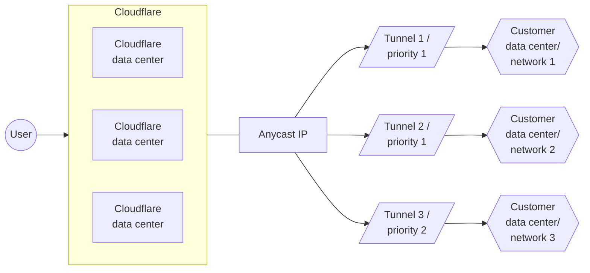

[Skip to content](#main-content)

> Documentation Index  
> Fetch the complete documentation index at: https://developers.cloudflare.com/style-guide/llms.txt  
> Use this file to discover all available pages before exploring further.

# Diagrams

Last updated Apr 24, 2026|Copy as Markdown|[View as Markdown](https://developers.cloudflare.com/style-guide/documentation-content-strategy/component-attributes/diagrams/index.md)|[Agent setup](https://developers.cloudflare.com/agent-setup/)

## Definition

Visualizations that depict a process, architecture, or some other form of technology. We recommend either using [SVG files](#svg-diagrams) or [Mermaid diagrams](#mermaid-diagrams).

## Used in

All content types

## Overview

Diagrams explain complex topics in a compelling way and help users visualize a specific solution, process, or interaction between products.

## SVG diagrams

Use SVG files instead of PNG or JPEG because SVG scales well when users want to zoom in. Use clear and straightforward `Alt text` with your SVG for use by screen readers.

We optimize SVG files with a [recurring script ↗](https://github.com/cloudflare/cloudflare-docs/blob/production/scripts/optimize-svgs.ts) in our repo.

### Template

```md

```

### Example


An example flow diagram

```md

```

## Mermaid diagrams

Use Mermaid diagrams to illustrate product or process flows. If they work for your use case, Mermaid diagrams are preferable to other [diagrams](https://developers.cloudflare.com/style-guide/documentation-content-strategy/component-attributes/diagrams/) because they are more easily searchable and changeable.

Our Mermaid diagrams are based on [rehype-mermaid ↗](https://github.com/remcohaszing/rehype-mermaid/) and [mermaid ↗](https://www.npmjs.com/package/mermaid).

### Template

flowchart LR
accTitle: Tunnels diagram
accDescr: The example in this diagram has three tunnel routes. Tunnels 1 and 2 have top priority and Tunnel 3 is secondary.

subgraph Cloudflare
direction LR
B[Cloudflare <br/> data center]
C[Cloudflare <br/> data center]
D[Cloudflare <br/> data center]
end

A((User)) --> Cloudflare --- E[Anycast IP]
E[Anycast IP] --> F[/Tunnel 1 / <br/> priority 1/] --> I{{Customer <br/> data center/ <br/> network 1}}
E[Anycast IP] --> G[/Tunnel 2 / <br/> priority 1/] --> J{{Customer <br/> data center/ <br/> network 2}}
E[Anycast IP] --> H[/Tunnel 3 / <br/> priority 2/] --> K{{Customer <br/> data center/ <br/> network 3}}

```plaintext

```

## Related components

* [Screenshots](https://developers.cloudflare.com/style-guide/documentation-content-strategy/component-attributes/screenshots/)

Was this helpful?

YesNo

## On this page

[Docs](https://developers.cloudflare.com/)

```json
{"@context":"https://schema.org","@type":"TechArticle","@id":"https://developers.cloudflare.com/style-guide/documentation-content-strategy/component-attributes/diagrams/#page","headline":"Diagrams · Cloudflare Style Guide","description":"Create and format diagrams in documentation.","url":"https://developers.cloudflare.com/style-guide/documentation-content-strategy/component-attributes/diagrams/","inLanguage":"en","image":"https://developers.cloudflare.com/og-docs.png","dateModified":"2026-04-24","publisher":{"@type":"Organization","name":"Cloudflare","url":"https://www.cloudflare.com/"},"isPartOf":{"@type":"WebSite","@id":"https://developers.cloudflare.com/#website","name":"Cloudflare Docs","url":"https://developers.cloudflare.com/"}}
```
