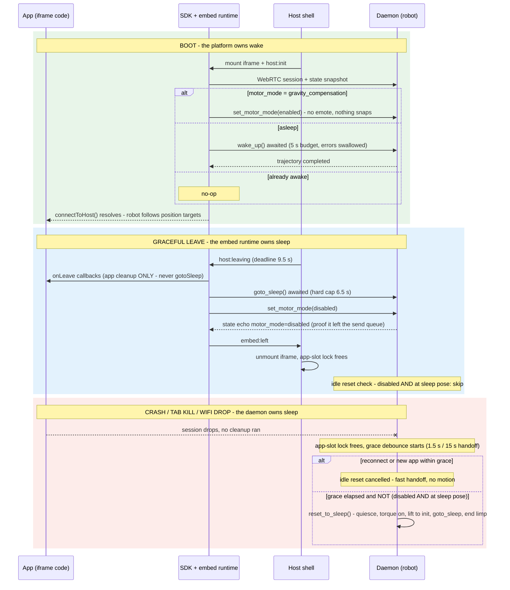

# Wake & Sleep Lifecycle Contract

This page is the reference for **who owns waking and sleeping the robot** across
the app / SDK / host / daemon boundary. Read it before touching any of:

- the daemon's motor-mode, idle-reset or trajectory code
  (`src/reachy_mini/daemon/backend/abstract.py`, `daemon.py`),
- the JS SDK's session bring-up (`ts/lib/reachy-mini.ts`),
- the host shell / embed runtime (`ts/host/src/`),
- any client that hosts apps (web host shell, mobile app).

## The contract in one line

**Apps never wake or sleep the robot. The platform does.** An app's only
lifecycle duty is cleaning up its *own* resources in `onLeave`.

## Actors

| Actor | Runs | Lifecycle role |
|---|---|---|
| App (embed) | iframe | Business logic only. Never calls `wakeUp` / `gotoSleep`. |
| Embed runtime | inside the iframe (`ts/host/src/embed/`) | `connectToHost()`: session bring-up incl. wake; graceful leave incl. sleep. |
| Host shell | parent frame (`ts/host/src/components/`) | OAuth, robot picker, mounts/unmounts the iframe, drives the leave handshake. |
| SDK | any client (`ts/lib/`) | WebRTC session, typed commands, `robotState` mirror, `ensureAwake()`. |
| Daemon | robot | Motor control modes, trajectories, app-slot lock, **idle-reset backstop**. |

The mobile app plays both the "host shell" and "embed runtime" roles for its own
session, with the same sequences (see `reachy_mini_mobile_app`,
`src/features/robot-session/physical.ts`).

## Ownership invariants

1. **Wake belongs to session bring-up.** The client platform layer calls
   `sdk.ensureAwake()` after `startSession()` and only reveals the app / flips
   to `live` once it resolves. Apps boot into a robot that is already under
   position control.
2. **Graceful sleep belongs to the client that orchestrates the leave** (embed
   runtime on `host:leaving`, mobile engine on teardown). It runs *before* the
   session drops, so the command still has a live data channel.
3. **Crash sleep belongs to the daemon.** Any session end that skipped the
   client-side cleanup (crash, killed tab, dropped Wi-Fi) is caught by the
   idle reset, which parks the robot from *any* motor state.
4. **Exactly one sleeper per path.** The predicate
   `motor_mode == Disabled AND is_at_sleep_pose()` is the coordination point:
   a clean leave satisfies it, so the idle reset stands down (no double
   trajectory, no double sound). Limp *anywhere else* is the crash signature
   and does get the reset.
5. **`connectToHost()` resolving means "robot drivable under position
   control"**, whatever state the previous session left behind.

## Boot: the wake path

`connectToHost()` (embed runtime) runs `connect() → startSession() →
ensureAwake()`, posting `embed:app-state` at each step so the host's overlay
can show *link / session / wake* progress. The iframe is only revealed on
`phase: 'live'`, i.e. after the wake settled.

`ensureAwake()` (SDK) is **idempotent and never rejects**:

- already `enabled` → no-op;
- `gravity_compensation` inherited from a fast handoff → flip to `enabled`
  *without* replaying the emote (the daemon pins targets to the measured pose
  on the way in, so nothing snaps). Gravity compensation *looks* awake but
  ignores position targets - this is the state a naive `isAwake()` check gets
  wrong;
- asleep → `wakeUp()` **awaited** to trajectory completion, bounded by
  `WAKE_TRAJECTORY_BUDGET_MS` (5 s). A timeout is swallowed: a wedged daemon
  must degrade the boot, not trap the user on the splash.

`wake_up()` (daemon) has its own stand-down: if the robot is already awake
**at the init pose** (commanded targets match, motors enabled), it silently
skips the emote (`is_awake_at_init_pose()`), so a boot-time wake after a
handoff replays nothing. `force=True` bypasses the stand-down for deliberate
replays (e.g. the mobile first-wake-up wizard).

## Graceful leave: the sleep path

Host side (`ReachyHostShell.endSession`): send `host:leaving` with a deadline,
show the leaving overlay, then wait for the embed's `embed:left` ack - bounded
by `LEAVING_ACK_CAP_MS` (9.5 s) so a wedged or pre-contract embed still falls
through.

Embed side (`runGracefulLeave`), mirroring the mobile app's
`sleepAndDisableRobot`:

1. Run the app's `onLeave` callbacks (app cleanup only, fire-and-forget).
2. `gotoSleep()` awaited (SDK timeout 6 s, JS hard cap 6.5 s) - the robot
   starts sleeping the moment the user leaves, no waiting on the daemon
   debounce.
3. `setMotorMode('disabled')` - the deterministic off-switch, sent while the
   data channel is still up.
4. **Wait for the daemon to echo `motor_mode: disabled` back**
   (`awaitMotorsDisabled`, 1 s cap). Without this, the host unmounting the
   iframe on the ack could kill the disable command while it still sits in the
   SCTP send queue.
5. Post `embed:left`; the host unmounts, the app-slot lock frees.

Result: when the slot frees, the robot is already limp **at the sleep pose**,
so the daemon's idle reset sees `_already_idle()` and does nothing.

`pagehide` (tab kill) is different: there is no time to play a trajectory, so
the embed only fires `onLeave` + best-effort `stopSession()` and the daemon
backstop does the sleeping.

## Crash / drop: the daemon backstop

When the `RobotAppLock` frees, the daemon calls
`request_idle_reset(expect_handoff=...)`:

- grace debounce: `IDLE_RESET_DEBOUNCE_S` (1.5 s) normally,
  `IDLE_RESET_HANDOFF_GRACE_S` (15 s) when the slot was released on purpose
  for a successor (covers an HF Space cold start);
- during the grace, any new data-channel command or a successor acquiring the
  slot **cancels** the reset - transient drops and fast handoffs produce no
  motion at all;
- after the grace, if the robot is not `Disabled AND at sleep pose`, run
  `reset_to_sleep()`.

`reset_to_sleep()` parks the robot from **any** inherited state:

1. `_quiesce_aim_sources()` - stop wobbling, clear speech offsets, disable
   head tracking, so nothing fights the trajectory;
2. `set_motor_control_mode(Enabled)` - re-establish position control. This
   covers gravity compensation, a global torque cut, *and* per-motor cuts:
   `set_motor_torque_ids()` sets `_partial_torque_override`, which forces the
   next mode set to re-apply even when the mode looks unchanged;
3. lift to the init pose if far from the sleep pose, then `goto_sleep()`
   (trajectory + sound), ending `Disabled` - limp at the sleep pose, like a
   fresh boot.

`Daemon.stop()` goes through the same `reset_to_sleep()` (with the idle-reset
hooks unwired first, so the relay teardown can't schedule a second, racing
sleep).

## Handoff between apps

Leaving app A to launch app B releases the slot *on purpose*
(`expect_handoff=True` → 15 s grace) and, on mobile, keeps the robot awake
through the swap (`releaseForHandoff`). App B's `ensureAwake()` then resolves
instantly (already awake) - or flips an inherited `gravity_compensation` back
to `enabled` without motion. No sleep, no wake emote, no snap.

## Key budgets

| Constant | Value | Where | Meaning |
|---|---|---|---|
| `WAKE_TRAJECTORY_BUDGET_MS` | 5 000 ms | SDK `ts/lib/reachy-mini.ts` | Max wait on the wake trajectory inside `ensureAwake()`. |
| `LEAVE_SLEEP_TIMEOUT_MS` / hard cap | 6 000 / 6 500 ms | embed `ts/host/src/embed/index.ts` | Bound on `gotoSleep()` during a graceful leave. |
| `LEAVE_DISABLE_CONFIRM_TIMEOUT_MS` | 1 000 ms | embed | Max wait for the daemon to echo `motor_mode: disabled`. |
| `LEAVING_ACK_CAP_MS` | 9 500 ms | host shell | Max time on the leaving overlay waiting for `embed:left`. |
| `IDLE_RESET_DEBOUNCE_S` | 1.5 s | daemon `abstract.py` | Grace before the backstop sleep on an unexpected drop. |
| `IDLE_RESET_HANDOFF_GRACE_S` | 15 s | daemon `abstract.py` | Grace when the slot was released for a successor. |
| `SLEEP_POSE_MAGIC_ATOL` | 10.0 | daemon `abstract.py` | Radius around the sleep pose for `is_at_sleep_pose()` and goto_sleep's no-travel branch - shared so they can't drift apart. |

## Lifecycle at a glance

## Rules for app builders

- Never call `wakeUp()` / `gotoSleep()` / `setMotorMode()` as part of your
  boot or teardown - the platform already does it, and doing it yourself
  causes double animations or races with the leave sequence.
- Use `onLeave` for *your* cleanup only (stop timers, close sockets, save
  state). Return a promise if you need the host to wait, but stay well under
  the host's leave deadline.
- If your app streams poses or watches stream health, clock that logic from a
  Web Worker so a backgrounded tab doesn't starve it (see
  "Handling backgrounded tabs" in the [JavaScript SDK guide](javascript-sdk)).

## Code map

| Piece | File |
|---|---|
| `ensureAwake()`, `wakeUp()`, `gotoSleep()` | `ts/lib/reachy-mini.ts` |
| Embed boot + graceful leave (`runGracefulLeave`) | `ts/host/src/embed/index.ts` |
| Host leave handshake (`endSession`, `LEAVING_ACK_CAP_MS`) | `ts/host/src/components/ReachyHostShell.tsx` |
| Protocol messages (`host:leaving`, `embed:left`, `embed:app-state`) | `ts/host/src/lib/protocol.ts` |
| Idle reset (`request_idle_reset`, `_already_idle`, graces) | `src/reachy_mini/daemon/backend/abstract.py` |
| `reset_to_sleep()`, `is_at_sleep_pose()`, `wake_up()` stand-down | `src/reachy_mini/daemon/backend/abstract.py` |
| Per-motor torque override (`_partial_torque_override`) | `src/reachy_mini/daemon/backend/robot/backend.py` |
| Slot-free / slot-acquired wiring | `src/reachy_mini/daemon/daemon.py` |
| Unit tests | `tests/unit_tests/test_backend_reset_to_sleep.py`, `test_backend_idle_reset.py` |
