# 设备归属管理

更新时间：2025-08-13 17:52:41

您可以通过“设备管理”功能将您渠道内的商米设备转赠给其他公司的合作伙伴，送出后设备的管理权将归接收方所有，赠送的设备不可回收。

## 设备分配

渠道分销类型的合作伙伴可以将发货给客户或者分公司的设备分配到这个子账户明细，让子账户拥有这些设备的管理权以及定制管理功能。

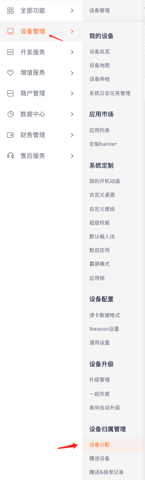

为子账户绑定设备设置步骤：

1.  使用主账号登录合作伙伴平台；

2.  点击“设备管理“页面中的“设备分配”，可选择“绑定子账户”为子账户单独绑定设备。

3.  如下图， “所属账户”对应栏位将显示设备绑定给哪一个子账户管理，而“所属账户”显示“-”的属于未绑定的设备，这些设备由主账号管理。

4.  批量绑定：如果需要将发货设备批量绑定给子账户，可以点击“批量绑定”，在弹出的对话框中选择需要绑定的子账户，然后直接粘贴 SN(文本)或者 拖拽 excel 文件后到框中进行解析。

点击右侧，选择“绑定子账户”，并选择子账户；

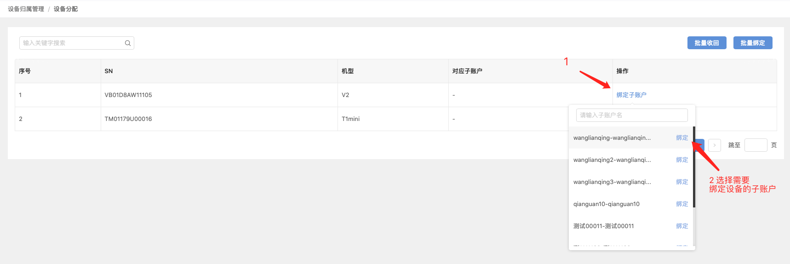

选择要绑定的子账户后，点击“确定”；

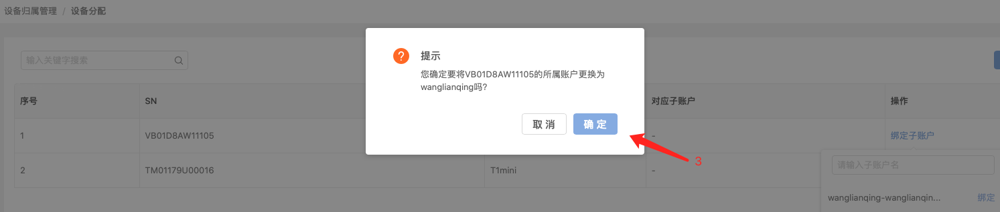

该设备已绑定在选中子账户下。

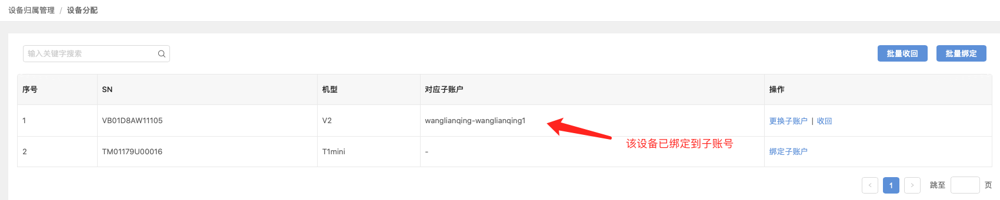

如您需要可以一次性绑定多台设备到子账户，点击“批量绑定”，出现下图，点击“选择子账户“，直接粘贴 SN(文本)或者 拖拽 excel到方框内，等待SN号码自动出现，点击“确定”。

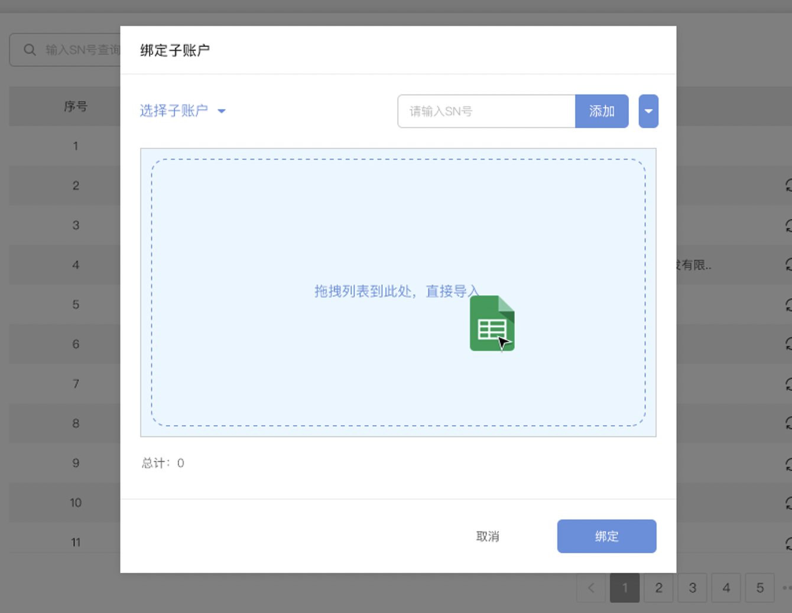

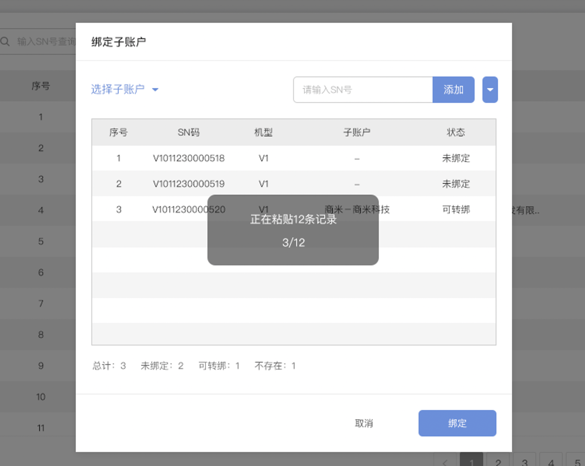

如何更改/收回子账户绑定设备？

1.  若设备已经绑定到子账户下，则会如下图，出现“更改子账户”和“收回”选项，可以通过这两种方式进行子账户更换和设备收回。

2.  【批量收回】若子账户下大量设备需要收回，也可使用批量收回，点击“批量收回”，在弹出的对话框中选择需要批量收回的账户，然后下载模板并填写，然后直接粘贴 SN(文本)或者 拖拽 excel 文件后到框中进行解析。

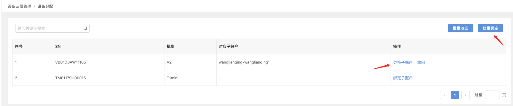

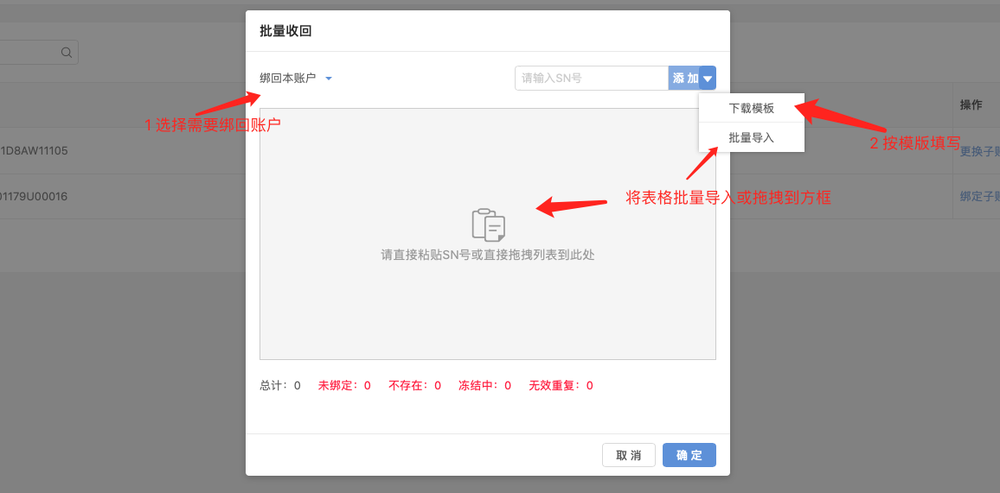

## 赠送设备

支持单台/多台赠送或多台多账户批量赠送

### 单台/多台赠送

赠送设备步骤：

1.  点击“设备管理“->“赠送设备”->选择赠送设备->选择目标账户，确认点击“确认赠送”设备；

注意：设备送出后无法收回，如果赠送错误可联络对方再转赠回来。每批次最多支持3000台。

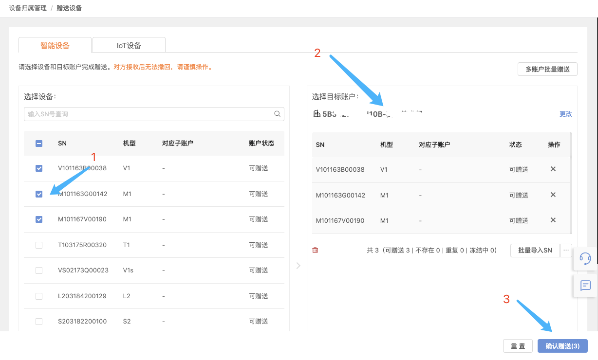

1.  接收方进入“设备管理“->“赠送&接收记录”，找到需要接收的设备，点击“接收”完成步骤。

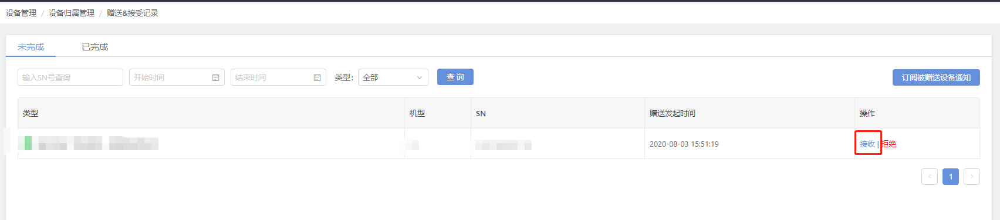

3.6.2.2 多账户批量赠送

赠送设备步骤：

1.  点击“设备管理“->“赠送设备”->“多账户批量赠送”，上传表格文件，确认点击“确认赠送”设备；

注意：设备送出后无法收回，如果赠送错误可联络对方再转赠回来（每批次最多支持3000台）。

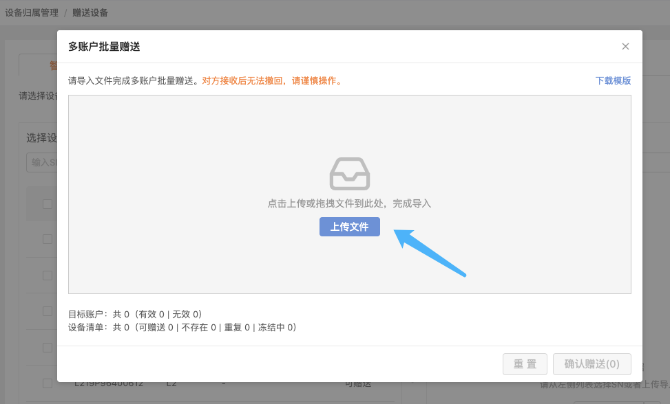

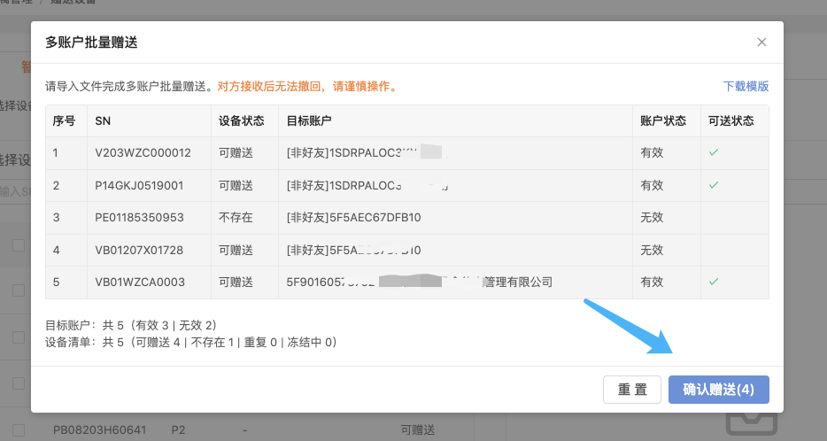

---

上一篇：配置文件常见问题
下一篇：灰度升级
