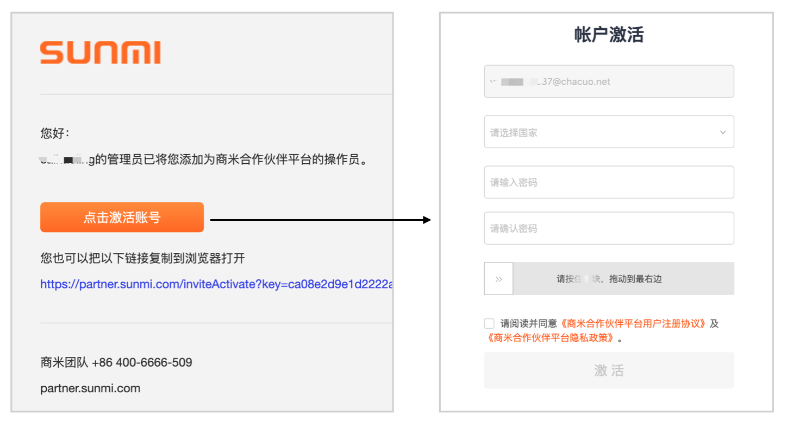
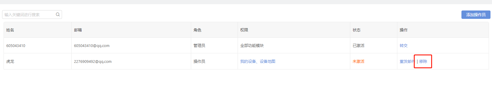
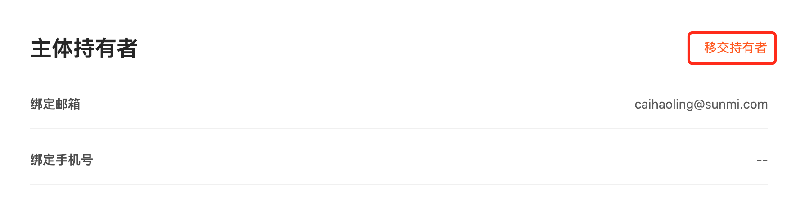
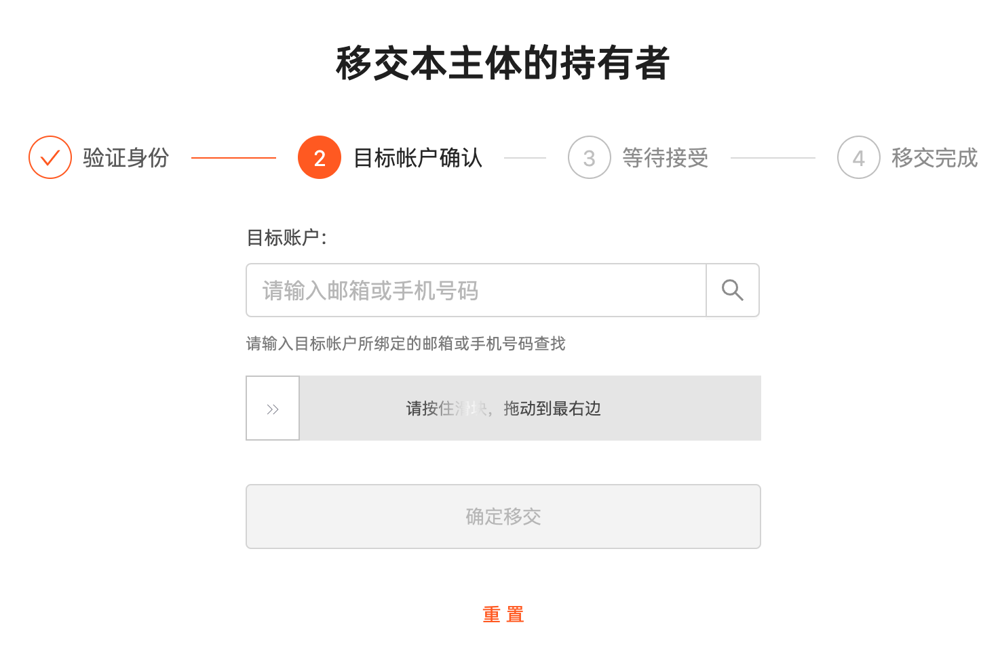
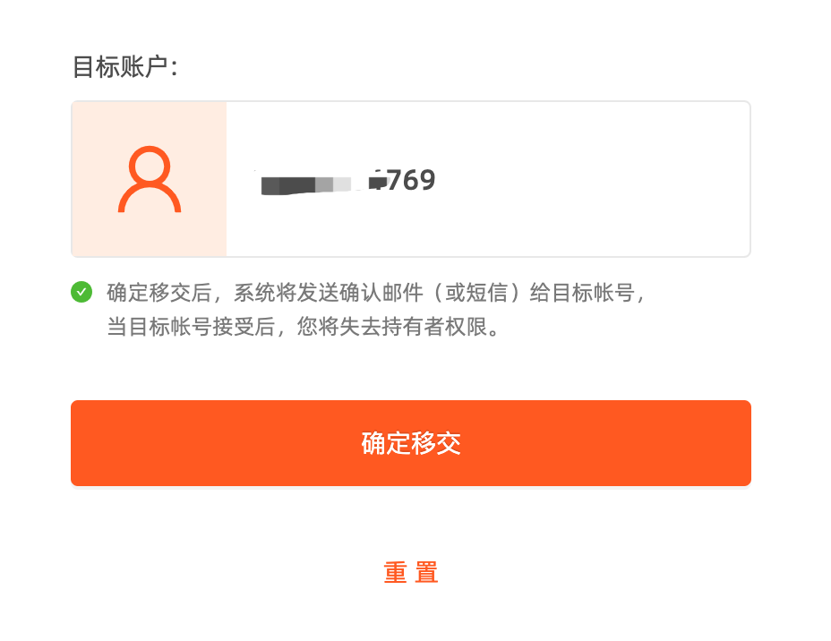

# 用户和权限

更新时间：2025-02-17 10:57:41

【管理员】: 用户可以使用这个帐号的所有功能，并且能建立、删除操作员，以及为操作员分配管理权限。还可以将管理员的身份转交给其中一个操作员。

【操作员】：操作员只能使用管理员为其分配的部分功能，操作员可以协助管理员管理这个帐号的商米设备。

一、新增操作员

添加操作员步骤：

1、点击操作员

2、输入操作员的邮箱，选择角色，点击发出邀请。邮箱作为操作员的登录帐号。

3、操作员在邮箱找到“添加操作员通知”邮件，点击链接激活帐号并设置登录密码。（注意：如果此前已登录合作伙伴平台账号请先登出，然后再打开邮件选择“点击激活帐号”，在新开启的网页中设置操作员登录密码。）

5、激活后完成添加操作。

二、删除操作员

如果您需要删除其中一个操作员帐号，您可以使用管理员账户登录合作伙伴平台，在“我的操作员”中将相应的操作员账号移除。

三、管理员权限转交

合作伙伴平台管理员还可以将管理员权限转交给其他人。原来的管理员将会脱离这个组织主体。

例如：当前“帐号 A”是管理员，点击“移交持有者”操作，可以将“帐号 B” 提升为管理员。

---

上一篇：单点登录SSO
下一篇：组织的管理
