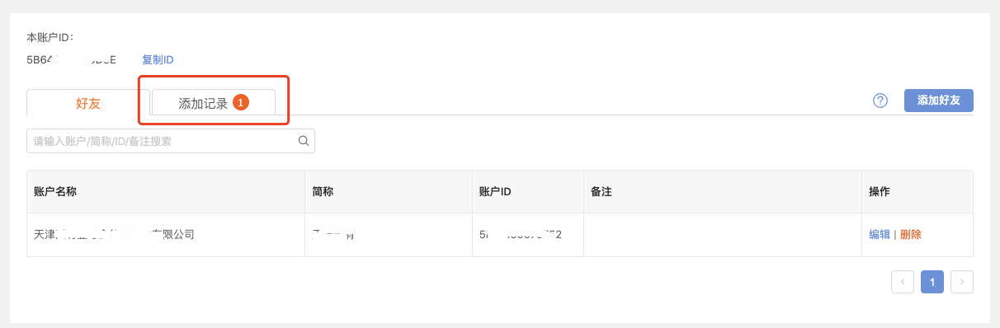
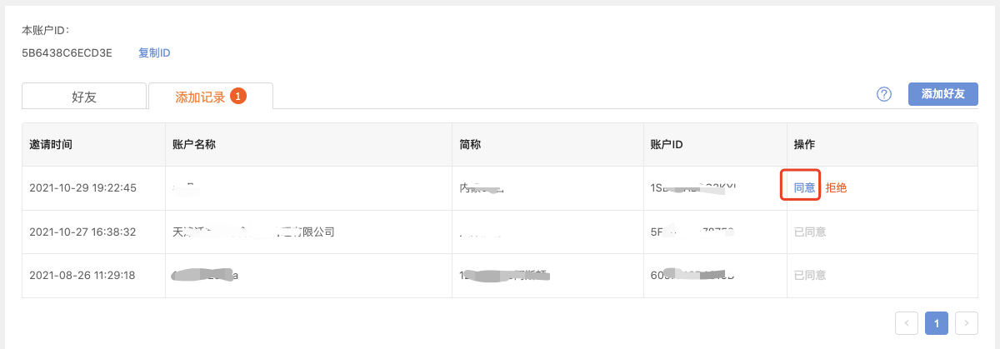

# 好友

更新时间：2024-12-24 15:54:44

合作伙伴可在平台上进行好友管理，进行好友的添加和删除。在“添加好友”中输入对方ID即可申请好友，成为好友关系后，开发者可以将非全部渠道可见的app对好友的账户设备可见

1、点击进入好友管理

2、查询好友ID并添加好友

3、通过好友申请发起好友申请后，在好友侧点击“新的朋友”，然后点击通过即可。

4、当您收到好友邀请时，在工作台首页可以快速查看邀请

---

上一篇：注册企业帐号
下一篇：帐号管理
