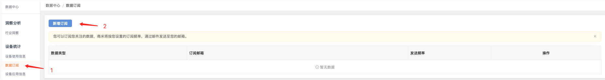
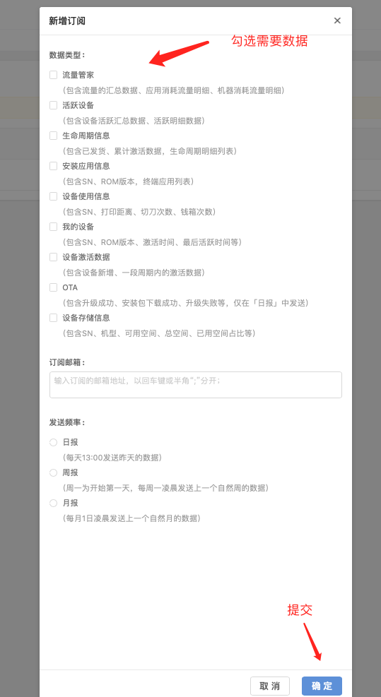
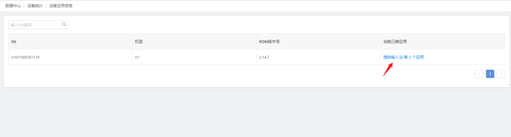
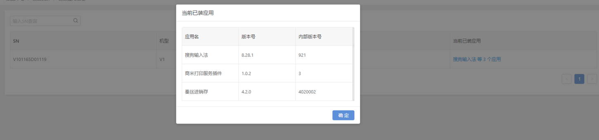

# 数据中心

更新时间：2024-12-24 15:40:07

## 订阅数据

您可以在【数据订阅】界面创建订阅任务，选择需要关注的数据、发送频率，并输入邮箱地址，系统将定期把数据文件发送至您的邮箱。

操作步骤：

1、点击界面右上角-数据订阅；

2、点击【新增订阅】按钮，选择需要订阅的数据类型、输入订阅邮箱、发送频率，最后点击确定按钮；

3、如果需要修改订阅数据，可以在订阅列表选择某个任务进行编辑；

注意：

终端在本地时间的凌晨12点后传到服务器；然后是在中国时区的凌晨3-4点，商米的后台脚本会进行统计数据，随后显示在合作伙伴后台的信息中。

## 设备应用信息

渠道合作伙伴可查看旗下已激活设备当前已安装的应用信息，点击右侧“当前已装应用”还可以查看具体的应用名称。

查看步骤： 点选“数据中心”—>“设备应用信息”

## 设备生命周期信息

渠道合作伙伴可查看旗下设备的发货、激活的日期，随时掌握旗下有哪些设备已开机激活，以及设备的保修期限。商米设备的质保期由“激活日期”或“发货之日起 30 天”计算，并以首先达到的时间点作为实际的质保期开始时间点。

查看步骤： 点选“数据中心”—>“设备生命周期信息”

## 激活统计

在该页面可以查看旗下所有设备的激活情况，可以筛选时间段以及按照型号分类选择。

统计的对比方式分为固定时间和动态对比两种方式，固定时间为确认的时间段内的对比，动态对比为非同一时间段内的数据对比。

## 活跃设备

活跃设备可查看 30 天内渠道设备的使用率情况，由此知晓哪些商户设备使用率高，为渠道合作伙伴提供终端使用数据信息收集。

查看步骤： 点选“数据中心”—>“活跃设备”

## 应用分析统计

---

上一篇：套餐到期-邮箱设置
下一篇：财务管理
